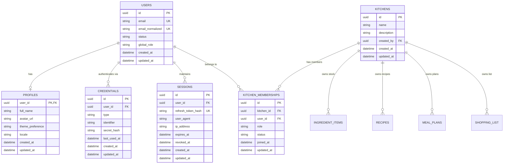
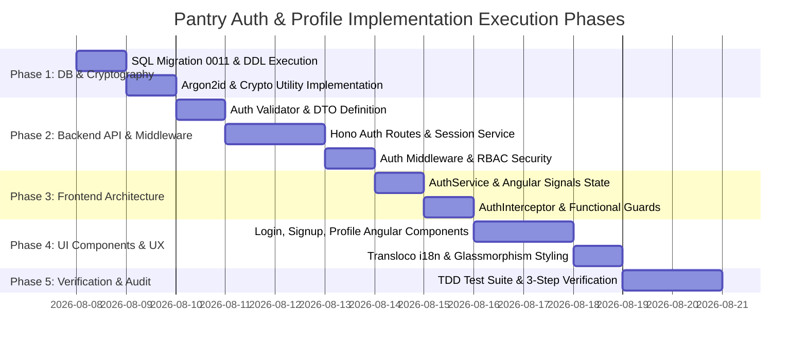

# Master Implementation Plan: User Authentication, Authorization & Profile System

> **Status:** Architectural Draft / Awaiting User Approval  
> **Author:** Lead Orchestrator AI & Domain Subagent Team (Security Auditor, Database Designer, Backend Developer, UI/UX Designer, Frontend Developer, QA Engineer)  
> **Target Version:** Pantry v1.5.0  

---

## Executive Summary

This document establishes the master architectural blueprint for introducing user authentication, authorization, user profiles, and multi-tenant **"Shared Kitchens"** access control into the Pantry codebase. 

The strategy combines enterprise-grade security protocols (Argon2id password hashing, HTTP-only SameSite refresh token rotation, in-memory short-lived access tokens, sliding-window rate limiting) with a flexible relational database schema engineered in SQLite (WAL mode). The frontend leverages Angular 20 Standalone components with PrimeNG glassmorphism styling, Transloco internationalization, reactive forms, and transparent silent-refresh HTTP interceptors.

---

## 1. Architecture & Database Schema

### 1.1 Relational Entity-Relationship Model (ERD)



---

### 1.2 SQL Schema DDL Migration (`backend/migrations/0011_user_auth_and_kitchens.sql`)

Following **RULE-03 (Immutable Migration Logs)** and **RULE-04**, database schema changes are added as new, idempotent sequential migration scripts.

```sql
-- Migration 0011: User Authentication, Profiles, and Shared Kitchens Schema

PRAGMA foreign_keys = ON;

-- 1. Users Table
CREATE TABLE IF NOT EXISTS users (
    id TEXT PRIMARY KEY DEFAULT (lower(hex(randomblob(4))) || '-' || lower(hex(randomblob(2))) || '-4' || substr(lower(hex(randomblob(2))),2) || '-' || substr('89ab', abs(random()) % 4 + 1, 1) || substr(lower(hex(randomblob(2))),2) || '-' || lower(hex(randomblob(6)))),
    email TEXT NOT NULL UNIQUE,
    email_normalized TEXT NOT NULL UNIQUE,
    status TEXT NOT NULL DEFAULT 'active' CHECK (status IN ('active', 'suspended', 'pending_verification')),
    global_role TEXT NOT NULL DEFAULT 'user' CHECK (global_role IN ('user', 'admin')),
    created_at TEXT DEFAULT (datetime('now')),
    updated_at TEXT DEFAULT (datetime('now'))
);

-- Trigger for users updated_at
CREATE TRIGGER IF NOT EXISTS update_users_updated_at
    AFTER UPDATE ON users
    FOR EACH ROW
BEGIN
    UPDATE users SET updated_at = datetime('now') WHERE id = OLD.id;
END;

-- 2. User Profiles Table
CREATE TABLE IF NOT EXISTS profiles (
    user_id TEXT PRIMARY KEY REFERENCES users(id) ON DELETE CASCADE,
    full_name TEXT NOT NULL,
    avatar_url TEXT,
    theme_preference TEXT NOT NULL DEFAULT 'system' CHECK (theme_preference IN ('light', 'dark', 'system')),
    locale TEXT NOT NULL DEFAULT 'en',
    created_at TEXT DEFAULT (datetime('now')),
    updated_at TEXT DEFAULT (datetime('now'))
);

CREATE TRIGGER IF NOT EXISTS update_profiles_updated_at
    AFTER UPDATE ON profiles
    FOR EACH ROW
BEGIN
    UPDATE profiles SET updated_at = datetime('now') WHERE user_id = OLD.user_id;
END;

-- 3. Credentials Table (Decoupled Auth Strategies: Password, OAuth, Passkeys)
CREATE TABLE IF NOT EXISTS credentials (
    id TEXT PRIMARY KEY DEFAULT (lower(hex(randomblob(4))) || '-' || lower(hex(randomblob(2))) || '-4' || substr(lower(hex(randomblob(2))),2) || '-' || substr('89ab', abs(random()) % 4 + 1, 1) || substr(lower(hex(randomblob(2))),2) || '-' || lower(hex(randomblob(6)))),
    user_id TEXT NOT NULL REFERENCES users(id) ON DELETE CASCADE,
    type TEXT NOT NULL CHECK (type IN ('password', 'google_oauth', 'passkey')),
    identifier TEXT NOT NULL,
    secret_hash TEXT NOT NULL,
    last_used_at TEXT,
    created_at TEXT DEFAULT (datetime('now')),
    updated_at TEXT DEFAULT (datetime('now')),
    UNIQUE(user_id, type)
);

-- 4. Sessions Table (Server-side Session State & Refresh Token Storage)
CREATE TABLE IF NOT EXISTS sessions (
    id TEXT PRIMARY KEY DEFAULT (lower(hex(randomblob(4))) || '-' || lower(hex(randomblob(2))) || '-4' || substr(lower(hex(randomblob(2))),2) || '-' || substr('89ab', abs(random()) % 4 + 1, 1) || substr(lower(hex(randomblob(2))),2) || '-' || lower(hex(randomblob(6)))),
    user_id TEXT NOT NULL REFERENCES users(id) ON DELETE CASCADE,
    refresh_token_hash TEXT NOT NULL UNIQUE,
    user_agent TEXT,
    ip_address TEXT,
    expires_at TEXT NOT NULL,
    revoked_at TEXT,
    created_at TEXT DEFAULT (datetime('now')),
    updated_at TEXT DEFAULT (datetime('now'))
);

-- 5. Kitchens Table (Multi-tenant Shared Workspaces)
CREATE TABLE IF NOT EXISTS kitchens (
    id TEXT PRIMARY KEY DEFAULT (lower(hex(randomblob(4))) || '-' || lower(hex(randomblob(2))) || '-4' || substr(lower(hex(randomblob(2))),2) || '-' || substr('89ab', abs(random()) % 4 + 1, 1) || substr(lower(hex(randomblob(2))),2) || '-' || lower(hex(randomblob(6)))),
    name TEXT NOT NULL,
    description TEXT,
    created_by TEXT REFERENCES users(id) ON DELETE SET NULL,
    created_at TEXT DEFAULT (datetime('now')),
    updated_at TEXT DEFAULT (datetime('now'))
);

-- 6. Kitchen Memberships Table (RBAC Mapping)
CREATE TABLE IF NOT EXISTS kitchen_memberships (
    id TEXT PRIMARY KEY DEFAULT (lower(hex(randomblob(4))) || '-' || lower(hex(randomblob(2))) || '-4' || substr(lower(hex(randomblob(2))),2) || '-' || substr('89ab', abs(random()) % 4 + 1, 1) || substr(lower(hex(randomblob(2))),2) || '-' || lower(hex(randomblob(6)))),
    kitchen_id TEXT NOT NULL REFERENCES kitchens(id) ON DELETE CASCADE,
    user_id TEXT NOT NULL REFERENCES users(id) ON DELETE CASCADE,
    role TEXT NOT NULL DEFAULT 'editor' CHECK (role IN ('owner', 'editor', 'viewer')),
    status TEXT NOT NULL DEFAULT 'active' CHECK (status IN ('active', 'invited')),
    joined_at TEXT DEFAULT (datetime('now')),
    updated_at TEXT DEFAULT (datetime('now')),
    UNIQUE(kitchen_id, user_id)
);

-- 7. Audit & Security Rate Limiting Table (Persistent IP & Action Rate Limiting)
CREATE TABLE IF NOT EXISTS auth_rate_limits (
    key TEXT PRIMARY KEY, -- e.g. "ip:192.168.1.1:login" or "email:user@domain.com:login"
    attempts INTEGER NOT NULL DEFAULT 1,
    first_attempt_at TEXT DEFAULT (datetime('now')),
    locked_until TEXT
);

-- High-Frequency Performance Indexes
CREATE INDEX IF NOT EXISTS idx_users_email_normalized ON users(email_normalized);
CREATE INDEX IF NOT EXISTS idx_credentials_user_type ON credentials(user_id, type);
CREATE INDEX IF NOT EXISTS idx_sessions_user_id ON sessions(user_id);
CREATE INDEX IF NOT EXISTS idx_sessions_refresh_hash ON sessions(refresh_token_hash);
CREATE INDEX IF NOT EXISTS idx_sessions_expires_at ON sessions(expires_at);
CREATE INDEX IF NOT EXISTS idx_kitchen_memberships_user_id ON kitchen_memberships(user_id);
CREATE INDEX IF NOT EXISTS idx_kitchen_memberships_kitchen_id ON kitchen_memberships(kitchen_id);
```

---

### 1.3 Transition Strategy for Multi-User Inventory Ownership

To guarantee seamless backward-compatibility for existing items, ingredients, recipes, and shopping lists:
1. **Schema Migration:** Add a `kitchen_id TEXT REFERENCES kitchens(id)` column to `ingredient_items`, `recipes`, `shopping_list`, and `meal_plans`.
2. **Backfill Trigger / Script:** When a user registers, an automatic **"Personal Kitchen"** is created for them (e.g., `[User's Name]'s Kitchen`).
3. **Data Backfill:** Unassigned legacy records are assigned to the primary initial admin/user's Personal Kitchen.

---

## 2. Security & Cryptography Protocol

### 2.1 Password Hashing & Sensitive PII Protection
- **Password Hashing Standard:** **Argon2id** (via Deno WebCrypto / `@db/argon2` or `scrypt` with parameters `memoryCost: 65536` (64MB), `timeCost: 3`, `parallelism: 4`).
- **Timing-Attack Resistance:** All string comparisons for security tokens, passwords, and HMAC hashes execute via `crypto.subtle.timingSafeEqual()` or constant-time string equality helpers.
- **PII Encryption at Rest:** Sensitive credentials, API keys, or MFA secrets are encrypted using AES-256-GCM (`crypto.subtle.encrypt`).

### 2.2 Dual-Token Architecture & Refresh Rotation

```mermaid
sequenceDiagram
    autonumber
    actor Client as Angular Frontend
    participant Server as Hono Auth Endpoint
    participant DB as SQLite Sessions Table

    Note over Client, Server: Login / Refresh Token Flow
    Client->>Server: POST /api/v1/auth/login {email, password}
    Server->>Server: Verify Argon2id Password Hash
    Server->>DB: Insert Session (Refresh Token Hash, Expiration: 7 Days)
    Server-->>Client: 200 OK<br/>Response Body: { accessToken (TTL 15m), user }<br/>Set-Cookie: __Host-pantry_refresh=TOKEN; HttpOnly; Secure; SameSite=Strict; Path=/api/v1/auth

    Note over Client, Server: Protected API Call
    Client->>Server: GET /api/v1/ingredient-items<br/>Header: Authorization: Bearer <accessToken>
    Server->>Server: Validate JWT Signature & Expiry
    Server-->>Client: 200 OK { ingredientItems }

    Note over Client, Server: Silent Token Refresh (AccessToken Expired)
    Client->>Server: POST /api/v1/auth/refresh (Cookie attached automatically)
    Server->>DB: Lookup Session by Refresh Token Hash
    alt Session Valid & Unexpired
        Server->>DB: Revoke Old Refresh Token & Issue New Session/Token (Rotation)
        Server-->>Client: 200 OK { newAccessToken }<br/>Set-Cookie: updated __Host-pantry_refresh
    else Token Reuse Detected (Stolen Token Attack)
        Server->>DB: REVOKE ALL SESSIONS FOR USER!
        Server-->>Client: 401 Unauthorized (Force Logout)
    end
```

#### Token Configuration Matrix
| Attribute | Access Token | Refresh Token |
| :--- | :--- | :--- |
| **Type** | Signed JWT (`HS256` / `RS256`) | Cryptographically Secure Random Hex String (32 bytes) |
| **Storage Location** | Client In-Memory (Angular Service / Signal) | `__Host-pantry_refresh` HTTP-only Cookie |
| **Lifespan / TTL** | 15 minutes | 7 days (sliding expiration on active use) |
| **Cookie Directives** | N/A | `HttpOnly; Secure; SameSite=Strict; Path=/api/v1/auth; Max-Age=604800` |
| **Rotation Strategy** | Reissued via `/refresh` | **Single-Use Rotation**: Old refresh token invalidated immediately upon exchange |

---

### 2.3 OWASP Top 10 Safeguards

1. **CSRF Mitigation:**
   - Refresh cookie uses `SameSite=Strict`.
   - Access tokens are passed via standard HTTP header `Authorization: Bearer <token>`, completely immune to ambient cookie CSRF attacks.
   - Anti-CSRF token header (`X-CSRF-Token`) enforced on sensitive state-changing POST/PUT requests.
2. **XSS Mitigation:**
   - Tokens are **NEVER** stored in `localStorage` or `sessionStorage` (preventing XSS exfiltration).
   - Strict `Content-Security-Policy` (CSP) and HTML escaping across Angular templates.
3. **Brute Force & Rate Limiting:**
   - **Sliding Window Rate Limiter:** Maximum 5 failed login attempts per email/IP pair within a 15-minute window before triggering a temporary 15-minute lock.
   - Exponential backoff delay (500ms baseline + jitter) on failed authentication attempts.
4. **Replay & Theft Protection:**
   - **Reuse Detection:** If an expired or previously rotated refresh token is presented, the system detects a potential token theft, invalidates **all active sessions** for that user ID, and forces a re-login.

---

## 3. Backend API & Middleware Specifications

### 3.1 Hono 5-Layer Backend Architecture

Per `.agents/skills/backend-endpoint/SKILL.md`, all auth routes adhere to the 5-layer separation:

```
Request ──> [ Auth Route Handler ] ──> [ Validator ] ──> [ Auth Service (Argon2 / DB) ] ──> Response DTO
                 │                                               │
          (src/routes/auth.ts)                         (src/services/auth.ts)
```

---

### 3.2 Endpoint Contracts

#### 1. POST `/api/v1/auth/signup`
- **Request Body DTO:**
  ```json
  {
    "email": "user@example.com",
    "password": "SecurePassword123!",
    "fullName": "Chef Ramsey"
  }
  ```
- **Response DTO (`201 Created`):**
  ```json
  {
    "user": {
      "id": "usr_9b1deb4d-3b7d-4bad-9bdd-2b0d7b3dcb6d",
      "email": "user@example.com",
      "fullName": "Chef Ramsey",
      "globalRole": "user"
    },
    "accessToken": "eyJhbGciOiJIUzI1NiIsInR5cCI6IkpXVCJ9...",
    "expiresIn": 900
  }
  ```

#### 2. POST `/api/v1/auth/login`
- **Request Body DTO:**
  ```json
  {
    "email": "user@example.com",
    "password": "SecurePassword123!"
  }
  ```
- **Response DTO (`200 OK`):**
  ```json
  {
    "user": {
      "id": "usr_9b1deb4d-3b7d-4bad-9bdd-2b0d7b3dcb6d",
      "email": "user@example.com",
      "fullName": "Chef Ramsey",
      "activeKitchenId": "ktc_11223344-5566-7788-9900-aabbccddeeff"
    },
    "accessToken": "eyJhbGciOiJIUzI1NiIsInR5cCI6IkpXVCJ9...",
    "expiresIn": 900
  }
  ```

#### 3. POST `/api/v1/auth/refresh`
- **Headers:** Attached `__Host-pantry_refresh` cookie.
- **Response DTO (`200 OK`):**
  ```json
  {
    "accessToken": "eyJhbGciOiJIUzI1NiIsInR5cCI6IkpXVCJ9...",
    "expiresIn": 900
  }
  ```

#### 4. POST `/api/v1/auth/logout`
- **Response DTO (`200 OK`):** Clears `__Host-pantry_refresh` cookie and marks session as `revoked_at = datetime('now')`.

#### 5. GET `/api/v1/me/profile` & PUT `/api/v1/me/profile`
- **Protected Endpoint:** Requires valid `Authorization: Bearer <accessToken>`.
- **Response DTO (`200 OK`):**
  ```json
  {
    "id": "usr_9b1deb4d-3b7d-4bad-9bdd-2b0d7b3dcb6d",
    "email": "user@example.com",
    "fullName": "Chef Ramsey",
    "avatarUrl": "https://avatar.example.com/ramsey.png",
    "themePreference": "system",
    "locale": "en",
    "memberships": [
      {
        "kitchenId": "ktc_11223344-5566-7788-9900-aabbccddeeff",
        "kitchenName": "Ramsey's Home Kitchen",
        "role": "owner"
      }
    ]
  }
  ```

---

### 3.3 Account Enumeration Prevention

- **Generic Error Messages:** `POST /auth/login` returns `401 Unauthorized` with body `{ "error": { "code": "INVALID_CREDENTIALS", "message": "Invalid email or password." } }` regardless of whether the email exists or the password was incorrect.
- **Constant-Time Verification:** If an email is not found in `users`, the backend still executes a dummy Argon2id hash calculation to ensure response times are identical, eliminating timing oracle vulnerability.

---

## 4. Frontend Architecture & UX Specs

### 4.1 Client-Side Auth State & Interceptors (Angular 20 Standalone)

- **`AuthService`**: Manages current user profile state (`WritableSignal<User | null>`) and access token (`WritableSignal<string | null>`). Access tokens remain purely in-memory.
- **`AuthInterceptor`**: Intercepts HTTP requests and attaches `Authorization: Bearer <accessToken>`. On `401 Unauthorized`, queues outgoing requests, invokes `POST /auth/refresh` silently, updates the token, and replays the original failed request seamlessly.
- **`AuthGuard`**: Protects angular routes (`app.routes.ts`) using Angular `canActivate` functional guards.

```ts
// Example Functional Auth Guard
export const authGuard: CanActivateFn = (route, state) => {
  const authService = inject(AuthService);
  const router = inject(Router);

  if (authService.isAuthenticated()) {
    return true;
  }
  return router.createUrlTree(['/login'], { queryParams: { returnUrl: state.url } });
};
```

---

### 4.2 PrimeNG 20 + Glassmorphism UI Components

Following [.agents/skills/ui-ux-design/SKILL.md](file:///Users/caelebkoharjo/Desktop/github/pantry/.agents/skills/ui-ux-design/SKILL.md):
- **Glassmorphism Themeing:** Card containers use `.glass-card` styling (`bg-white/60 dark:bg-surface-800/60 backdrop-blur-md border border-surface-200/80 dark:border-surface-800/80 rounded-2xl`).
- **Strict Form Height Alignment:** All input elements (`p-inputText`, `p-password`) enforce explicit `42px` height (`h-[42px]`) with rounded corners (`rounded-xl`).
- **Label Vertical Baseline Alignment:** Header labels wrapped in `<div class="flex items-center justify-between h-6 mb-1.5">`.

```html
<!-- Login Form Component Template Excerpt -->
<div class="max-w-md mx-auto p-8 glass-card rounded-2xl shadow-xl">
  <h2 class="text-2xl font-bold text-surface-900 dark:text-white tracking-tight mb-6">
    {{ 'auth.login.title' | transloco }}
  </h2>

  <form [formGroup]="loginForm" (ngSubmit)="onSubmit()" class="space-y-4">
    <div>
      <div class="flex items-center justify-between h-6 mb-1.5">
        <label class="text-xs font-semibold uppercase tracking-wider text-surface-600 dark:text-surface-400">
          {{ 'auth.login.emailLabel' | transloco }} <span class="text-rose-500">*</span>
        </label>
      </div>
      <input 
        pInputText 
        type="email" 
        formControlName="email" 
        class="w-full !h-[42px] !rounded-xl"
        [placeholder]="'auth.login.emailPlaceholder' | transloco"
      />
    </div>

    <div>
      <div class="flex items-center justify-between h-6 mb-1.5">
        <label class="text-xs font-semibold uppercase tracking-wider text-surface-600 dark:text-surface-400">
          {{ 'auth.login.passwordLabel' | transloco }} <span class="text-rose-500">*</span>
        </label>
      </div>
      <p-password 
        formControlName="password" 
        [toggleMask]="true" 
        styleClass="w-full !h-[42px]"
        inputStyleClass="w-full !h-[42px] !rounded-xl"
        [feedback]="false"
      ></p-password>
    </div>

    <button 
      pButton 
      type="submit" 
      [loading]="isSubmitting()"
      [disabled]="loginForm.invalid || isSubmitting()"
      class="w-full !h-[42px] !rounded-xl p-button-primary"
    >
      {{ 'auth.login.submitButton' | transloco }}
    </button>
  </form>
</div>
```

---

### 4.3 Transloco i18n Dictionary Additions (`frontend/public/i18n/en.json`)

Per **RULE-04**, user-facing strings must be localized:

```json
{
  "auth": {
    "login": {
      "title": "Welcome Back",
      "emailLabel": "Email Address",
      "emailPlaceholder": "chef@pantry.app",
      "passwordLabel": "Password",
      "submitButton": "Sign In",
      "invalidCredentials": "Invalid email or password."
    },
    "signup": {
      "title": "Create Your Account",
      "fullNameLabel": "Full Name",
      "submitButton": "Create Account"
    }
  },
  "profile": {
    "title": "User Profile",
    "themePreference": "Theme Preference",
    "locale": "Language / Region",
    "saveSuccess": "Profile updated successfully."
  },
  "kitchen": {
    "title": "Shared Kitchens",
    "roleOwner": "Owner",
    "roleEditor": "Editor",
    "roleViewer": "Viewer"
  }
}
```

---

## 5. Testing & Validation Strategy

Following **RULE-01 (TDD Methodology)** and **RULE-06 (Mandatory 3-Step Verification Workflow)**:

### 5.1 Unit Testing Strategy (`backend/tests/auth_crypto.test.ts`)
- **Argon2id Hashing:** Verify password hashing and correct verification. Verify failed verification on wrong password.
- **Timing-Safe Comparison:** Test string comparison functions against length mismatches and equal strings.
- **JWT Token Generation & Verification:** Verify token structure, expiration timestamp validation, signature integrity, and tampered token rejection.

### 5.2 Integration Testing Strategy (`backend/tests/auth_routes.test.ts`)
- **Signup Lifecycle:** Test `POST /auth/signup` creates `users`, `credentials`, `profiles`, and `kitchens` records.
- **Login Lifecycle:** Test `POST /auth/login` validates credentials and returns `accessToken` while setting HTTP-only refresh cookie.
- **Refresh & Rotation:** Test `POST /auth/refresh` exchanges refresh token for a new access token and updates the refresh token cookie.
- **Reuse Detection Trigger:** Present an already-invalidated refresh token and verify all user sessions are immediately revoked (`401 Unauthorized`).

### 5.3 Frontend Unit & Spec Testing (`frontend/src/app/pages/login/login.component.spec.ts`)
- **Form Validation:** Confirm submit button remains disabled when email format is invalid or password is empty.
- **Interceptor Error Handling:** Simulate `401 Unauthorized` response to verify silent refresh trigger.

---

## 6. Step-by-Step Execution Plan



### Detailed Phase Breakdown

1. **Phase 1: DB Schema & Cryptography Protocol**
   - Create `backend/migrations/0011_user_auth_and_kitchens.sql`.
   - Run `cd backend && deno task db:migrate`.
   - Create `backend/src/utils/crypto.ts` implementing Argon2id hashing and timing-safe equality.
   - Run unit tests (`deno task test`).

2. **Phase 2: Backend API Endpoints & Auth Middleware**
   - Create `backend/src/models/auth.ts` defining all Request/Response interfaces.
   - Implement `backend/src/validators/auth.ts`.
   - Implement `backend/src/services/auth.ts` and `backend/src/routes/auth.ts`.
   - Implement `backend/src/middleware/auth.ts` for Bearer JWT verification and rate limiting.
   - Format and lint (`deno fmt && deno lint`).

3. **Phase 3: Frontend Client Auth Architecture**
   - Create `frontend/src/app/models/auth.model.ts`.
   - Create `frontend/src/app/services/auth.service.ts` using Angular Signals.
   - Create `frontend/src/app/utility/auth.interceptor.ts` and `frontend/src/app/utility/auth.guard.ts`.

4. **Phase 4: Frontend UI Components & Transloco i18n**
   - Create `frontend/src/app/pages/login/login.component.ts`.
   - Create `frontend/src/app/pages/signup/signup.component.ts`.
   - Create `frontend/src/app/pages/profile/profile.component.ts`.
   - Update `frontend/public/i18n/en.json` with all `auth.*` and `profile.*` keys.
   - Verify PrimeNG 20 styling, `42px` field heights, and glassmorphism theme consistency.

5. **Phase 5: Automated Testing & 3-Step Verification**
   - Run backend test suite (`cd backend && deno task test`).
   - Run frontend spec test suite (`cd frontend && npm run test`).
   - Confirm clean lint & format (`cd backend && deno lint && deno fmt` and `cd frontend && npm run format && npm run lint`).
   - Confirm production compilation (`cd frontend && npm run build`).

---

> **PAUSE POINT:** `AUTH_IMPLEMENTATION_PLAN.md` is generated and saved in the root of the workspace. Awaiting user review and explicit approval before executing implementation steps.
