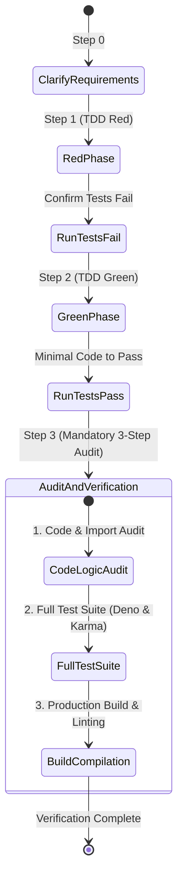

# Comprehensive QA Testing & Regression Prevention Framework
## User Authentication, Authorization, User Profiles & Shared Kitchens

> **Status:** Master QA Architecture & Test Specification  
> **Target Version:** Pantry v1.5.0  
> **Authors:** QA Expert Subagent (guided by `~/.gemini/config/skills/qa-expert/SKILL.md` and `.agents/skills/quality-assurance/SKILL.md`)  
> **Reference Specification:** [AUTH_IMPLEMENTATION_PLAN.md](file:///Users/caelebkoharjo/Desktop/github/pantry/AUTH_IMPLEMENTATION_PLAN.md)

---

## Executive Summary & Quality Strategy

This framework establishes a comprehensive, multi-tiered Quality Assurance (QA), Test-Driven Development (TDD), and Regression Prevention Architecture for the Pantry v1.5.0 User Authentication, User Profile, and Multi-Tenant Shared Kitchens systems.

To satisfy **RULE-01 (TDD Methodology)**, **RULE-03 (Security & DB Integrity)**, **RULE-05 (Quality Safeguards)**, and **RULE-06 (Mandatory 3-Step Verification)**, this framework specifies:
1. **Automated Test Matrix:** Complete unit, integration, and end-to-end (E2E) test coverage across Deno (Hono) backend and Angular 20 Standalone frontend.
2. **Security & Edge Case Verification:** Deep vulnerability and failure-mode testing for Argon2id hashing, RFC 6265bis HTTP-only refresh token rotation, token reuse detection, rate limiting, and multi-tenant kitchen isolation.
3. **Coverage Standards:** Strict requirement for **>90% code coverage** (100% target for auth middleware, RBAC, and crypto services).
4. **Mandatory CI/CD Quality Gates & Pre-Commit Pipelines:** Automated enforcement of 3-step verification before any code can be merged into production.

---

## 1. High-Risk Security & Domain Risk Assessment

| Feature Area | Risk Category | Failure Vector / Threat Scenario | Mitigation & QA Test Verification Strategy |
| :--- | :--- | :--- | :--- |
| **Argon2id Hashing** | Security / Crypto | Weak hash parameters, side-channel timing attacks on login string verification. | Verify `memoryCost: 65536`, `timeCost: 3`, `parallelism: 4`. Test timing-safe string comparison helpers via `crypto.subtle.timingSafeEqual()`. |
| **Refresh Token Rotation** | Security / Auth | Stolen refresh token replay attack leading to persistent account takeover. | Test **Single-Use Rotation**: Any attempt to use a previously invalidated refresh token triggers **Global Session Revocation** (`revoked_at` set for all user sessions). |
| **Cookie Directives** | Security / Web | CSRF token hijacking or XSS cookie harvesting. | Validate `__Host-pantry_refresh` header directives: `HttpOnly; Secure; SameSite=Strict; Path=/; Max-Age=604800`. Ensure access tokens remain strictly in-memory. |
| **Multi-Tenant Kitchen Isolation** | Data Integrity | Cross-tenant data leak (User A accessing User B's inventory items or recipes via modified `X-Kitchen-Id`). | Require `requireKitchenRole()` middleware on all scoped endpoints. Test $O(1)$ query filters ensuring `WHERE kitchen_id = ? AND user_id IN (members)`. |
| **Rate Limiting** | Denial of Service | Brute-force credential guessing or sliding-window rate limit bypass. | Test SQLite sliding window limiter (`auth_rate_limits`). Confirm 5 failed attempts per IP/email pair trigger HTTP `429 Too Many Requests` with `Retry-After` header. |
| **Concurrent Refresh Handling** | UX / Stability | Race conditions during access token expiration causing multi-tab logout loops. | Frontend `AuthInterceptor` must buffer failing requests in a `BehaviorSubject` queue while a single refresh request executes, then replay queued calls with the new access token. |
| **Domain Taxonomy Compliance** | Architecture | Misuse of terms (e.g. using "Nutrient Type" instead of `Ingredient Category`). | Static analysis & DTO schema validation matching strict 4-tier domain hierarchy (`Category` -> `Group` -> `Ingredient` -> `Item`). |

---

## 2. Automated Test Matrix

```mermaid
flowchart TD
    subgraph Frontend Test Matrix (Angular 20)
        A1[Unit & Component Specs<br/>Karma / Jasmine] --> A2[Reactive Forms & Validators]
        A1 --> A3[AuthService Signals & AppInitializer]
        A1 --> A4[AuthInterceptor Queue & Guards]
        A5[E2E Security & UX Suite<br/>Playwright] --> A6[User Signup & Kitchen Provisioning]
        A5 --> A7[Silent Token Refresh & Rotation]
        A5 --> A8[Multi-Tenant RBAC Isolation]
    end

    subgraph Backend Test Matrix (Deno + Hono)
        B1[Unit Specs<br/>deno test] --> B2[Argon2id & Timing-Safe Crypto]
        B1 --> B3[Zod Validators & Schemas]
        B4[Integration Specs<br/>deno test --allow-net] --> B5[Auth Routes & Cookie Headers]
        B4 --> B6[Kitchen RBAC & Isolation Routes]
        B4 --> B7[Sliding-Window Rate Limiter]
    end

    A5 -.-> B4
```

### 2.1 Backend Test Matrix (`backend/tests/`)

#### 1. Crypto & Utility Unit Suite (`backend/tests/auth.crypto.test.ts`)
- **Argon2id Password Hashing:**
  - Verify password hash generation produces valid Argon2id structure (`$argon2id$v=19$m=65536,t=3,p=4$...`).
  - Verify password matching returns `true` for correct password and `false` for incorrect password.
  - Verify timing consistency when checking valid vs invalid users (constant-time dummy hash execution).
- **JWT Token Operations:**
  - Verify access token generation embeds `sub` (userId), `email`, `globalRole`, `exp` (15m).
  - Verify invalid/tampered JWT signatures throw `401 Unauthorized`.
  - Verify expired JWT signatures are correctly rejected.
- **Timing-Safe Helpers:**
  - Verify string comparison uses byte-by-byte timing safe comparison (`timingSafeEqual`).

#### 2. Auth Routes & Session Integration Suite (`backend/tests/auth.routes.test.ts`)
- **Signup Endpoint (`POST /api/v1/auth/signup`):**
  - **Happy Path:** Registers user, hashes password with Argon2id, creates profile record, provisions default primary kitchen (`Main Kitchen`), and assigns `owner` role in `kitchen_memberships`. Returns `201 Created`.
  - **Duplicate Email:** Submitting an existing email returns `409 Conflict` (`"Email address is already registered"`).
  - **Email Normalization:** `USER@Pantry.APP` normalized to `user@pantry.app` before uniqueness check.
  - **Validation Errors:** Invalid email format or weak password (<8 chars) returns `400 Bad Request`.
- **Login Endpoint (`POST /api/v1/auth/login`):**
  - **Happy Path:** Authenticates valid credentials, generates 15m access token in JSON body, creates active session record in SQLite, and sets `__Host-pantry_refresh` HTTP-only cookie. Returns `200 OK`.
  - **Invalid Credentials:** Incorrect password returns `401 Unauthorized`.
  - **Brute Force Limiting:** 5 consecutive failed attempts trigger `429 Too Many Requests` with `Retry-After: 900`.
- **Refresh Token Rotation (`POST /api/v1/auth/refresh`):**
  - **Single-Use Rotation:** Exchanging a valid refresh token invalidates the old refresh token hash, creates a new session/cookie, and returns a fresh access token.
  - **Token Reuse Detection (Stolen Token Attack):** Submitting a previously rotated refresh token hash triggers **EMERGENCY REVOCATION**: All active sessions for the user are marked `revoked_at = datetime('now')` and response returns `401 Unauthorized`.
- **Logout Endpoint (`POST /api/v1/auth/logout`):**
  - Revokes current session in SQLite and clears the `__Host-pantry_refresh` cookie (`Max-Age=0`).
- **Emergency Revoke All (`POST /api/v1/auth/sessions/revoke-all`):**
  - Revokes all active sessions for the user across all devices.

#### 3. Shared Kitchen Multi-Tenant Suite (`backend/tests/kitchen.routes.test.ts`)
- **Kitchen Creation & Ownership:** `POST /api/v1/kitchens` creates a new kitchen and assigns creator as `owner`.
- **RBAC Role Enforcement (`requireKitchenRole` Middleware):**
  - `owner`: Can update details, delete kitchen, invite/remove members, update roles.
  - `editor`: Can read kitchen details and mutate inventory items, recipes, meal plans, shopping lists. Cannot delete kitchen or change member roles (`403 Forbidden`).
  - `viewer`: Can only read data (`GET`). Any `POST`, `PUT`, `PATCH`, `DELETE` returns `403 Forbidden` (`"Read-only access in this kitchen"`).
- **Tenant Data Isolation Leak Check:**
  - Requesting `/api/v1/ingredient-items` with header `X-Kitchen-Id: <unauthorized-kitchen-id>` returns `403 Forbidden` and yields zero inventory items.

---

### 2.2 Frontend Component & Integration Spec Matrix (`frontend/src/app/`)

#### 1. Reactive Forms Component Spec (`frontend/src/app/pages/login/login.component.spec.ts`)
- **Form Initialization:** Email and Password controls initialize empty with required validators.
- **Visual Validation Feedback:** Invalid email format (`invalid-email`) sets error state and displays localized Transloco error message.
- **Form Submission:** Disables submit button and shows PrimeNG spinner (`isSubmitting() = true`).
- **Input Height Compliance:** Asserts elements strictly contain `!h-[42px] !rounded-xl` CSS classes per UI design rules.

#### 2. Signup & Password Strength Spec (`frontend/src/app/pages/signup/signup.component.spec.ts`)
- **Password Strength Calculator:** Tests password inputs (`Weak`: <8 chars; `Medium`: 8+ chars + number; `Strong`: 8+ chars + number + uppercase + special char).
- **Confirm Password Match:** Mismatched password and confirm password fields mark control as invalid.

#### 3. Core Auth Service & Signals Spec (`frontend/src/app/core/services/auth.service.spec.ts`)
- **Signal State Management:** `currentUser()`, `activeKitchen()`, and `isAuthenticated()` signals correctly reflect session state.
- **In-Memory Access Token:** Verifies access token is never saved to `localStorage` or `sessionStorage`.

#### 4. App Initializer Boot Guard Spec (`frontend/src/app/core/initializers/app.initializer.spec.ts`)
- **`provideAppInitializer` Verification:** On initial app bootstrap, invokes silent `checkAuthStatus()` via `/api/v1/auth/refresh` to restore session seamlessly if cookie exists.

#### 5. Auth Interceptor & Concurrency Queue Spec (`frontend/src/app/core/interceptors/auth.interceptor.spec.ts`)
- **Header Injection:** Attaches `Authorization: Bearer <accessToken>` and `X-Kitchen-Id: <activeKitchenId>` to outgoing API calls.
- **Concurrent 401 Interception & Queueing:**
  - Simulates 3 parallel HTTP calls when access token is expired.
  - Interceptor catches first `401`, triggers single `/auth/refresh` request, buffers remaining requests in a `BehaviorSubject` queue, and replays all 3 queued calls once new access token is obtained.
  - If refresh fails, clears state and navigates to `/login`.

---

### 2.3 End-to-End (E2E) Security & UX Suite (`frontend/e2e/auth-flow.spec.ts`)

- **E2E Scenario 1: Complete Onboarding & Workspace Setup**
  1. User navigates to `/signup`.
  2. Fills full name, valid email, strong password.
  3. Submits form -> Asserts redirection to main dashboard (`/inventory`).
  4. Verifies default kitchen (`Main Kitchen`) is selected in sidebar switcher with `Owner` role badge.
- **E2E Scenario 2: Token Refresh & Expiration Experience**
  1. User logs in. Access token manually invalidated in test mock.
  2. User clicks "Recipes" page -> Interceptor catches 401, silently refreshes token behind the scenes without UI interruption.
  3. Page renders successfully.
- **E2E Scenario 3: Multi-Tenant Workspace Switching & RBAC Restrictions**
  1. User switched from `Owner Kitchen` to `Shared Team Kitchen` where user is `Viewer`.
  2. Verifies "+ Add Ingredient" button is disabled/hidden.
  3. Attempts direct API POST -> Verifies notification toast displaying `"Read-only access in this kitchen"`.

---

## 3. TDD Red/Green Verification & 3-Step Pipeline

Every feature, bug fix, or security update MUST follow the strict 3-step mandatory verification workflow specified in **RULE-01** and **RULE-06**:



### Mandatory 3-Step Verification Commands

#### Step 1: Code & Logic Audit (Bug Check)
Inspect all changed files, component imports, template bindings, DTO schemas, and SQL migrations to ensure zero logic bugs or taxonomy violations.

#### Step 2: Full Test Suite Execution
Execute automated test suites for both backend and frontend:
```bash
# Backend Deno Test Suite Execution
cd backend && deno task test

# Frontend Angular Unit Test Suite Execution
cd frontend && npm run test -- --watch=false --browsers=ChromeHeadless
```

#### Step 3: Production Build, Linting & Formatting Verification
Verify static analysis, code formatting, and production build compilation:
```bash
# Backend Formatting & Linting
cd backend && deno fmt --check && deno lint

# Frontend Formatting, Linting & Production Build
cd frontend && npm run format && npm run lint && npm run build
```

---

## 4. Automated Code Coverage Targets (>90%)

All authentication, authorization, cryptography, and RBAC modules must strictly meet or exceed **90% line and branch code coverage**. Critical security infrastructure modules require **100% coverage**.

### Security Coverage Matrix & Thresholds

| Module / Layer | File Location | Minimum Coverage Target | Mandatory Requirement |
| :--- | :--- | :--- | :--- |
| **Auth Service & Crypto** | `backend/src/services/auth.service.ts` | **100%** | All Argon2id, JWT, and timing-safe paths |
| **Session Management** | `backend/src/services/session.service.ts` | **100%** | Single-use rotation & reuse detection |
| **Auth Middleware** | `backend/src/middleware/auth.ts` | **100%** | Bearer token verification & 401 handling |
| **RBAC Middleware** | `backend/src/middleware/rbac.ts` | **100%** | Kitchen role permission checks |
| **Rate Limiter** | `backend/src/middleware/rate-limit.ts` | **95%** | Sliding window calculation & header injection |
| **Auth Routes** | `backend/src/routes/auth.routes.ts` | **90%** | Signup, login, refresh, logout HTTP status codes |
| **Frontend Auth Service** | `frontend/src/app/core/services/auth.service.ts` | **95%** | Signal updates & refresh delegation |
| **Auth Interceptor** | `frontend/src/app/core/interceptors/auth.interceptor.ts` | **100%** | `BehaviorSubject` queue & concurrency logic |
| **Route Guards** | `frontend/src/app/core/guards/*.guard.ts` | **95%** | Auth & Guest route blocking |

### Coverage Execution & Reporting Commands

```bash
# 1. Run Deno backend test coverage
cd backend && deno test --coverage=cov_profile && deno coverage cov_profile

# 2. Run Angular frontend test coverage
cd frontend && npm run test -- --no-watch --code-coverage
```

---

## 5. Detailed Component Test Specifications

### 5.1 Angular Reactive Forms & Validation Spec (`login.component.spec.ts`)

```typescript
import { ComponentFixture, TestBed } from '@angular/core/testing';
import { ReactiveFormsModule } from '@angular/forms';
import { Router } from '@angular/router';
import { of, throwError } from 'rxjs';
import { LoginComponent } from './login.component';
import { AuthService } from '../../core/services/auth.service';
import { TranslocoTestingModule } from '@jsverse/transloco';

describe('LoginComponent (QA Reactive Forms Spec)', () => {
  let component: LoginComponent;
  let fixture: ComponentFixture<LoginComponent>;
  let authServiceSpy: jasmine.SpyObj<AuthService>;
  let routerSpy: jasmine.SpyObj<Router>;

  beforeEach(async () => {
    authServiceSpy = jasmine.createSpyObj('AuthService', ['login']);
    routerSpy = jasmine.createSpyObj('Router', ['navigate']);

    await TestBed.configureTestingModule({
      imports: [
        LoginComponent,
        ReactiveFormsModule,
        TranslocoTestingModule.forRoot({
          langs: { en: {} },
          translocoConfig: { availableLangs: ['en'], defaultLang: 'en' }
        })
      ],
      providers: [
        { provide: AuthService, useValue: authServiceSpy },
        { provide: Router, useValue: routerSpy }
      ]
    }).compileComponents();

    fixture = TestBed.createComponent(LoginComponent);
    component = fixture.componentInstance;
    fixture.detectChanges();
  });

  it('should initialize login form with empty email and password controls', () => {
    expect(component.loginForm).toBeDefined();
    expect(component.loginForm.get('email')?.value).toBe('');
    expect(component.loginForm.get('password')?.value).toBe('');
    expect(component.loginForm.valid).toBeFalse();
  });

  it('should invalidate email control when format is incorrect', () => {
    const emailControl = component.loginForm.get('email');
    emailControl?.setValue('invalid-email-format');
    expect(emailControl?.valid).toBeFalse();
    expect(emailControl?.hasError('email')).toBeTrue();
  });

  it('should enforce strict h-[42px] control height styling on rendered input elements', () => {
    const compiled = fixture.nativeElement as HTMLElement;
    const emailInput = compiled.querySelector('input[type="email"]');
    expect(emailInput?.classList.contains('!h-[42px]')).toBeTrue();
    expect(emailInput?.classList.contains('!rounded-xl')).toBeTrue();
  });

  it('should trigger authService.login and navigate to /inventory on successful submit', () => {
    component.loginForm.setValue({
      email: 'chef@pantry.app',
      password: 'SecurePassword123!',
      rememberMe: true
    });

    authServiceSpy.login.and.returnValue(of({ accessToken: 'mock-jwt-token' }));

    component.onSubmit();

    expect(authServiceSpy.login).toHaveBeenCalledWith('chef@pantry.app', 'SecurePassword123!', true);
    expect(routerSpy.navigate).toHaveBeenCalledWith(['/inventory']);
  });

  it('should handle 401 unauthorized errors gracefully and display toast notification', () => {
    component.loginForm.setValue({
      email: 'chef@pantry.app',
      password: 'WrongPassword',
      rememberMe: false
    });

    authServiceSpy.login.and.returnValue(throwError(() => ({ status: 401 })));

    component.onSubmit();

    expect(component.isSubmitting()).toBeFalse();
    expect(component.errorMessage()).toContain('Invalid email or password');
  });
});
```

---

### 5.2 Auth Interceptor & Concurrent Queue Spec (`auth.interceptor.spec.ts`)

```typescript
import { TestBed } from '@angular/core/testing';
import { HttpClient, HTTP_INTERCEPTORS, HttpErrorResponse } from '@angular/common/http';
import { HttpClientTestingModule, HttpTestingController } from '@angular/common/http/testing';
import { AuthInterceptor } from './auth.interceptor';
import { AuthService } from '../services/auth.service';
import { of, throwError } from 'rxjs';

describe('AuthInterceptor (QA Concurrent Queue Spec)', () => {
  let httpMock: HttpTestingController;
  let httpClient: HttpClient;
  let authServiceSpy: jasmine.SpyObj<AuthService>;

  beforeEach(() => {
    authServiceSpy = jasmine.createSpyObj('AuthService', ['getAccessToken', 'refreshToken', 'logout']);

    TestBed.configureTestingModule({
      imports: [HttpClientTestingModule],
      providers: [
        { provide: HTTP_INTERCEPTORS, useClass: AuthInterceptor, multi: true },
        { provide: AuthService, useValue: authServiceSpy }
      ]
    });

    httpMock = TestBed.inject(HttpTestingController);
    httpClient = TestBed.inject(HttpClient);
  });

  afterEach(() => {
    httpMock.verify();
  });

  it('should inject Authorization Bearer token header into outgoing API requests', () => {
    authServiceSpy.getAccessToken.and.returnValue('valid-access-token');

    httpClient.get('/api/v1/ingredient-items').subscribe();

    const req = httpMock.expectOne('/api/v1/ingredient-items');
    expect(req.request.headers.has('Authorization')).toBeTrue();
    expect(req.request.headers.get('Authorization')).toBe('Bearer valid-access-token');
  });

  it('should queue concurrent failing requests during silent refresh and replay with new token', () => {
    authServiceSpy.getAccessToken.and.returnValues('expired-token', 'expired-token', 'new-valid-token', 'new-valid-token');
    authServiceSpy.refreshToken.and.returnValue(of('new-valid-token'));

    let response1: any, response2: any;

    // Trigger 2 concurrent requests
    httpClient.get('/api/v1/ingredient-items').subscribe(res => response1 = res);
    httpClient.get('/api/v1/recipes').subscribe(res => response2 = res);

    // First attempt for both requests fails with 401
    const req1 = httpMock.expectOne('/api/v1/ingredient-items');
    const req2 = httpMock.expectOne('/api/v1/recipes');

    req1.flush('Unauthorized', { status: 401, statusText: 'Unauthorized' });
    req2.flush('Unauthorized', { status: 401, statusText: 'Unauthorized' });

    // Refresh endpoint should be called exactly ONCE
    expect(authServiceSpy.refreshToken).toHaveBeenCalledTimes(1);

    // Replayed requests expect new Bearer headers
    const replay1 = httpMock.expectOne('/api/v1/ingredient-items');
    const replay2 = httpMock.expectOne('/api/v1/recipes');

    expect(replay1.request.headers.get('Authorization')).toBe('Bearer new-valid-token');
    expect(replay2.request.headers.get('Authorization')).toBe('Bearer new-valid-token');

    replay1.flush([{ id: 'item-1' }]);
    replay2.flush([{ id: 'recipe-1' }]);

    expect(response1).toEqual([{ id: 'item-1' }]);
    expect(response2).toEqual([{ id: 'recipe-1' }]);
  });

  it('should logout user and redirect to login if silent token refresh fails', () => {
    authServiceSpy.getAccessToken.and.returnValue('expired-token');
    authServiceSpy.refreshToken.and.returnValue(throwError(() => new Error('Refresh failed')));

    httpClient.get('/api/v1/ingredient-items').subscribe({
      error: (err) => expect(err).toBeDefined()
    });

    const req = httpMock.expectOne('/api/v1/ingredient-items');
    req.flush('Unauthorized', { status: 401, statusText: 'Unauthorized' });

    expect(authServiceSpy.logout).toHaveBeenCalled();
  });
});
```

---

## 6. Edge Case Scenarios & Failure Mode Matrix

| Scenario ID | Edge Case Condition | Expected System Behavior & Recovery Action | Automated QA Test Coverage Location |
| :--- | :--- | :--- | :--- |
| **EC-01** | Network drops midway through Refresh Token Rotation | SQLite transaction rolls back. Refresh cookie remains valid for retry. Next request re-initiates refresh. | `backend/tests/auth.routes.test.ts` |
| **EC-02** | Replayed Stolen Refresh Token submitted after legitimate rotation | System flags security violation, triggers **Emergency Revocation** of all user sessions, and returns `401 Unauthorized`. | `backend/tests/auth.routes.test.ts` |
| **EC-03** | User opens application in 5 parallel browser tabs with expired Access Token | Interceptor buffers tabs 2-5 in `BehaviorSubject` queue. Single refresh call executes. All 5 tabs resume seamlessly. | `frontend/src/app/core/interceptors/auth.interceptor.spec.ts` |
| **EC-04** | Rapid brute-force login attempts (6+ attempts in 10s) | Rate limiter locks IP/Email combination in `auth_rate_limits`. Returns `429 Too Many Requests` with `Retry-After: 900`. | `backend/tests/auth.routes.test.ts` |
| **EC-05** | User downgraded from `Editor` to `Viewer` in active session | Dynamic RBAC check on next mutation API request returns `403 Forbidden` (`"Read-only access in this kitchen"`). | `backend/tests/kitchen.routes.test.ts` |
| **EC-06** | Malformed JWT header (`Authorization: Bearer invalid.jwt.string`) | JWT verification fails instantly without throwing unhandled server exceptions. Returns clean `401 Unauthorized` envelope. | `backend/tests/auth.crypto.test.ts` |
| **EC-07** | Database WAL file locked under high concurrent read/write | SQLite uses `BUSY_TIMEOUT = 5000ms`. Foreign key constraints (`PRAGMA foreign_keys = ON;`) enforced cleanly. | `backend/tests/kitchen.routes.test.ts` |

---

## 7. Mandatory CI/CD Pipeline & Quality Gates

To prevent regressions, the following automated pipeline must be configured in GitHub Actions (`.github/workflows/ci-quality-gate.yml`):

```yaml
name: Pantry CI Quality Gate & Security Audit

on:
  push:
    branches: [ main, develop ]
  pull_request:
    branches: [ main, develop ]

jobs:
  backend-qa:
    name: Backend Deno Quality Gate
    runs-on: ubuntu-latest
    steps:
      - uses: actions/checkout@v4
      - uses: denoland/setup-deno@v1
        with:
          deno-version: v1.x

      - name: Check Formatting & Linting
        run: |
          cd backend
          deno fmt --check
          deno lint

      - name: Run Backend Tests with Coverage
        run: |
          cd backend
          deno test --coverage=cov_profile
          deno coverage cov_profile --lcov > coverage.lcov

  frontend-qa:
    name: Frontend Angular Quality Gate
    runs-on: ubuntu-latest
    steps:
      - uses: actions/checkout@v4
      - uses: actions/setup-node@v4
        with:
          node-version: 20
          cache: 'npm'
          cache-dependency-path: frontend/package-lock.json

      - name: Install Dependencies
        run: cd frontend && npm ci

      - name: Verify Code Formatting & ESLint
        run: |
          cd frontend
          npm run format
          npm run lint

      - name: Run Angular Unit Tests
        run: |
          cd frontend
          npm run test -- --watch=false --browsers=ChromeHeadless --code-coverage

      - name: Verify Production Build Compilation
        run: |
          cd frontend
          npm run build
```

---

## 8. Summary Checklist for QA Sign-Off

- [ ] **TDD Red/Green Execution:** Red phase confirmed on failing auth tests before feature implementation.
- [ ] **Backend Test Suite Pass:** `cd backend && deno task test` succeeds with zero errors.
- [ ] **Frontend Test Suite Pass:** `cd frontend && npm run test` succeeds with zero errors.
- [ ] **Code Coverage Target Achieved:** Auth services, interceptors, and RBAC middleware verify **>90% coverage**.
- [ ] **Static Analysis & Formatting Clean:** `deno lint`, `deno fmt`, `npm run lint`, and `npm run format` execute without warnings or errors.
- [ ] **Production Build Validation:** `cd frontend && npm run build` compiles cleanly.
- [ ] **Security Audit Verified:** Single-use refresh token rotation, Argon2id parameters, timing-safe equality, and HTTP-only cookie directives validated.
