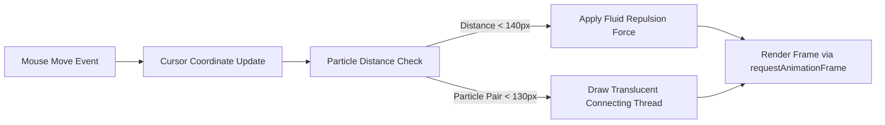

# 🎨 Pantry Visual Design System & Theme Specification

**Document Version:** `2.0.0`  
**Last Updated:** `August 7, 2026`  
**Status:** `Approved & Implemented`  

---

## 📌 1. Overview & Strategic Goals

This document specifies the updated **Pantry Visual Design System**, establishing a high-contrast, modern SaaS aesthetic across light and dark modes.

### Key Objectives:
1. **Eliminate "Muddy/Dirty" Light Mode Cast:** Replaced the previous yellow-brown sand tones (`#f7f5f0`, `#ede9e1`) with a crisp, porcelain-slate surface palette (`#f8fafc`, `#f1f5f9`, `#e2e8f0`).
2. **Elevate Glassmorphism:** Upgraded `.glass-card` and `.glass-header` elements to use translucent crystal layers paired with precise border definition.
3. **Interactive Ambient Canvas:** Replaced static culinary SVG icons with a dynamic HTML5 canvas particle web that responds fluidly to cursor movement.
4. **WCAG AA Compliance:** Ensured all body text, input borders, badges, and headers exceed WCAG AA contrast standards (>7:1 contrast ratio for body text).

---

## 🎨 2. Color System & Design Tokens

All surface colors are declared via Tailwind CSS theme variables in [`frontend/src/styles.scss`](file:///Users/caelebkoharjo/Desktop/github/pantry/frontend/src/styles.scss#L7-L46).

### 2.1 Surface Palette (`--color-surface-*`)

| Token | HEX Code | Usage & Context |
| :--- | :--- | :--- |
| `--color-surface-50` | `#f8fafc` | Main application canvas background (Light Mode) |
| `--color-surface-100` | `#f1f5f9` | Sub-container background, badge fills, input surface |
| `--color-surface-200` | `#e2e8f0` | Refined card borders, divider lines, light mode outlines |
| `--color-surface-300` | `#cbd5e1` | Input focus borders, disabled state lines, hover outlines |
| `--color-surface-400` | `#94a3b8` | Placeholder text, subtle icon strokes |
| `--color-surface-500` | `#64748b` | Secondary metadata labels, timestamps, field hints |
| `--color-surface-600` | `#475569` | Section subheadings, group labels |
| `--color-surface-700` | `#334155` | Medium emphasis text, tab headers |
| `--color-surface-800` | `#1e293b` | High emphasis body text, list item names |
| `--color-surface-900` | `#0f172a` | Primary titles, page `<h1>` headings, modal titles |
| `--color-surface-950` | `#020617` | Dark mode base canvas background |

### 2.2 Brand & Semantic Accent Tokens

```scss
/* Primary Culinary Accent: Energetic Vibrant Orange */
--color-primary-500: #f97316;
--color-primary-600: #ea580c;

/* Status & Category Accents */
--color-emerald-500: #10b981; /* Fresh / Restocked / Match Success */
--color-amber-500:   #f59e0b; /* Low Stock Warning / Expiry Alert */
--color-rose-500:    #f43f5e; /* Expired / Destructive Action */
--color-indigo-500:  #6366f1; /* New Creation / Info Badges */
```

---

## 💎 3. Glassmorphism & Component Architecture

### 3.1 Main Glass Cards (`.glass-card`)
Containers, modal panels, and inventory overview cards use high-saturate blur with precise border definition:

```scss
.glass-card {
  background: rgba(255, 255, 255, 0.82);
  backdrop-filter: blur(16px) saturate(140%);
  -webkit-backdrop-filter: blur(16px) saturate(140%);
  border: 1px solid rgba(226, 232, 240, 0.9); /* Slate 200 high-contrast border */
  box-shadow:
    0 10px 30px -10px rgba(15, 23, 42, 0.06),
    0 2px 6px -1px rgba(15, 23, 42, 0.03);
}

:where(.dark, .dark *) .glass-card {
  background: rgba(30, 41, 59, 0.78); /* Slate 800 */
  backdrop-filter: blur(16px) saturate(140%);
  -webkit-backdrop-filter: blur(16px) saturate(140%);
  border: 1px solid rgba(255, 255, 255, 0.08);
  box-shadow:
    0 10px 30px -10px rgba(0, 0, 0, 0.4),
    0 2px 6px -1px rgba(0, 0, 0, 0.2);
}
```

### 3.2 Inset Panels & Hover Cards (`.sub-card`, `.sub-card-hover`)

```scss
.sub-card, .sub-card-inset {
  background-color: #ffffff !important;
  border: 1px solid var(--color-surface-200) !important;
  box-shadow:
    inset 0 1px 2px rgba(255, 255, 255, 1),
    0 1px 3px rgba(15, 23, 42, 0.04) !important;
}

.sub-card-hover:hover {
  background-color: #ffffff !important;
  border-color: var(--color-primary-500) !important;
  box-shadow: 0 4px 12px -2px rgba(249, 115, 22, 0.15) !important;
}
```

---

## ✨ 4. Interactive Canvas Particle Web System

The background layer in [`app.component.html`](file:///Users/caelebkoharjo/Desktop/github/pantry/frontend/src/app/app.component.html#L3-L12) and [`app.component.ts`](file:///Users/caelebkoharjo/Desktop/github/pantry/frontend/src/app/app.component.ts#L69-L215) renders an interactive 2D node web:



---

## 🛠️ 5. Maintainer & Developer Verification Checklist

Whenever adding or modifying UI components in `frontend/src/app/`, verify:

- [x] Surface background classes use Tailwind variables (`bg-surface-50`, `bg-surface-100`, `text-surface-900`).
- [x] Cards use standard `.glass-card` or `.sub-card` classes instead of custom inline HEX styles.
- [x] Form inputs satisfy the standard 42px height (`h-[42px]`).
- [x] Light and Dark modes pass production compilation (`npm run build`).
- [x] Full unit test suite passes (`npm run test`).
