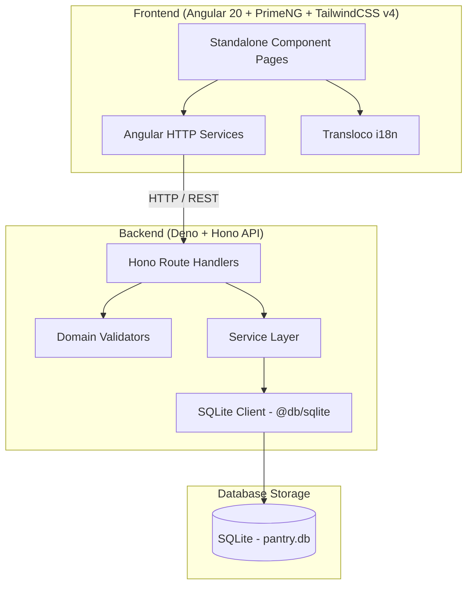

# 🧺 Pantry

A comprehensive full-stack inventory management application designed to track pantry items, manage ingredient taxonomies, organize recipes, plan meals, and generate shopping lists.

---

## 🏗️ System Architecture & Tech Stack

The application is structured as a monorepo containing an **Angular 20** frontend and a **Deno + Hono** RESTful API backend, utilizing an embedded **SQLite** database.



### 🗄️ Database & Taxonomy Architecture

The core domain relies on a 3-tier ingredient taxonomy and physical stock batch management:

1. **Ingredient Category** *(Tier 1)*: Broad nutritional classification (e.g. *Protein & Dairy*, *Fiber & Produce*, *Carbs & Grains*, *Quick Foods*, *Fats & Oils*).
2. **Ingredient Group** *(Tier 2)*: Specific sub-categories (e.g. *Meat*, *Seafood*, *Beans*, *Vegetables*, *Fruits*, *Grains*, *Pasta*, *Snacks*, *Sweets*).
3. **Ingredient** *(Tier 3)*: Master ingredient definition (e.g. *Chicken Breast*, *Jasmine Rice*, *Apple*) with default unit and group link.
4. **Ingredient Item (Batch)**: Physical stock instance in a storage location (e.g. *Fridge*, *Freezer*, *Pantry*) tracking expiration date, quantity, purchase date, and status.

---

### ⚙️ Technology Stack

#### Backend (`/backend`)
- **Runtime:** [Deno](https://deno.land/) (2.x)
- **Framework:** [Hono](https://hono.dev/) - Ultra-fast web standard based framework
- **Database:** Embedded SQLite (via `@db/sqlite`) running in **WAL mode** with foreign key enforcement (`pantry.db`)
- **Architecture:** Controller/Route Handlers -> Domain Validators -> Service Layer -> SQLite Database Client
- **Migrations & Seeding:** Custom SQL migration runner (`scripts/migrate_db.ts`) and database seeder (`scripts/seed_db.ts`)
- **Testing:** Deno built-in test runner (`deno test`)

#### Frontend (`/frontend`)
- **Framework:** [Angular 20](https://angular.dev/) (Standalone Component Architecture)
- **Styling:** [TailwindCSS v4](https://tailwindcss.com/) with PostCSS & SCSS Glassmorphism Theme System (`glass-card`, dynamic palettes)
- **UI Components:** [PrimeNG 20](https://primeng.org/) & PrimeIcons
- **Internationalization:** [Transloco](https://ngneat.github.io/transloco/) (`@jsverse/transloco`)
- **Testing & E2E:** Vitest (unit tests), Playwright (E2E testing), ESLint & Prettier

#### Infrastructure & Deployment
- **Docker & Nginx:** Production containerization for the Angular frontend using a multi-stage Docker build served via Nginx.
- **Docker Compose:** Container orchestration for production frontend deployment.

---

## 📂 Project Structure

```
pantry/
├── backend/                        # Deno + Hono API Server
│   ├── migrations/                 # Sequential SQL migration files (0001–0015)
│   ├── scripts/                    # DB migration, reset, and seed scripts
│   │   ├── migrate_db.ts
│   │   ├── reset_db.ts
│   │   ├── seed_db.ts
│   │   └── seed_data.ts            # Master seed data definitions
│   ├── src/
│   │   ├── config/                 # Environment & app setup
│   │   ├── db/                     # SQLite database connection & PRAGMAs
│   │   ├── middleware/             # CORS, Logger, Error Handler
│   │   ├── models/                 # DTOs & DB Schema models
│   │   ├── routes/                 # Hono API endpoints (items, ingredients, groups, recipes, etc.)
│   │   ├── services/               # Business logic & DB queries
│   │   ├── utils/                  # API response formatting & generic validators
│   │   ├── validators/             # Request payload validators
│   │   └── app.ts                  # App initialization & route mounting
│   ├── tests/                      # Integration and unit tests
│   ├── main.ts                     # Backend entry point
│   └── deno.json                   # Deno tasks & dependencies configuration
│
└── frontend/                       # Angular 20 SPA Application
    ├── src/
    │   ├── app/
    │   │   ├── components/         # Reusable UI components (header, sidebar, cards, breadcrumbs)
    │   │   ├── models/             # Frontend interfaces & types
    │   │   ├── pages/              # Standalone page views
    │   │   │   ├── home/           # Dashboard overview & key metrics
    │   │   │   ├── inventory/      # 3-tier inventory & ingredient group management
    │   │   │   ├── recipes/        # Recipe management & ingredient availability matching
    │   │   │   ├── meal-planner/   # Weekly meal planning calendar
    │   │   │   └── shopping-list/  # Dynamic shopping list & sync
    │   │   ├── services/           # HTTP services connecting to REST backend
    │   │   ├── app.component.ts    # Main app layout
    │   │   └── app.routes.ts       # Application routing
    │   ├── assets/                     # Images (i18n dictionaries live in public/i18n/)
    │   └── styles.scss             # Global design system & theme CSS
    ├── nginx.conf                  # Nginx configuration for Docker production build
    ├── Dockerfile                  # Multi-stage Angular build Dockerfile
    └── docker-compose.yml          # Production frontend container setup
```

---

## 🚀 Getting Started

### Prerequisites

- [Deno](https://deno.land/) (2.x)
- [Node.js](https://nodejs.org/) (v20+ LTS) & NPM

---

### 1. Backend Setup

1. Navigate to the backend folder:
   ```bash
   cd backend
   ```

2. Setup environment variables (optional for local defaults):
   ```bash
   cp .env.example .env
   ```

3. Run migrations and seed sample data:
   ```bash
   deno task db:migrate
   deno task db:seed
   ```

4. Start the backend development server (with hot-reload):
   ```bash
   deno task dev
   ```
   *The REST API will start at `http://localhost:8000`.*

---

### 2. Frontend Setup

1. Navigate to the frontend folder:
   ```bash
   cd frontend
   ```

2. Install dependencies:
   ```bash
   npm install
   ```

3. Start the Angular development server:
   ```bash
   npm start
   ```
   *Navigate to `http://localhost:4200/` in your browser.*

---

## 🛠️ Key CLI Commands

### Backend Tasks (Deno)

| Command | Description |
| :--- | :--- |
| `deno task dev` | Start API server in watch/dev mode |
| `deno task start` | Start API server in production mode |
| `deno task test` | Run backend test suite |
| `deno task db:migrate` | Execute pending database migrations |
| `deno task db:seed` | Seed database with taxonomy and sample inventory |
| `deno task db:reset` | Reset and re-create database (drops existing data) |
| `deno fmt` | Format TypeScript backend files |
| `deno lint` | Lint backend code |

### Frontend Commands (npm / Angular)

| Command | Description |
| :--- | :--- |
| `npm start` | Start Angular development server (`ng serve`) |
| `npm run build` | Build production bundle (`ng build`) |
| `npm run test` | Run unit tests with Vitest |
| `npm run e2e` | Run end-to-end tests with Playwright |
| `npm run lint` | Run ESLint check |
| `npm run format` | Format files with Prettier |

---

## 🐳 Docker Deployment

The **root** `docker-compose.yml` runs the full stack (API + frontend). The backend
reads `ENVIRONMENT=production` in this setup and will refuse to start unless a secure
`JWT_SECRET` is provided:

```bash
JWT_SECRET=<unique-secret-32+-chars> docker compose up --build -d
```

The application will be served on port `4200`, with `/api` proxied to the backend on
port `8000`. Note: `frontend/docker-compose.yml` exists for image builds only — it has
no backend service and its API proxy will not resolve.
