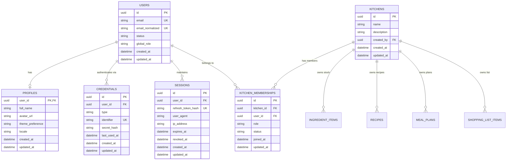
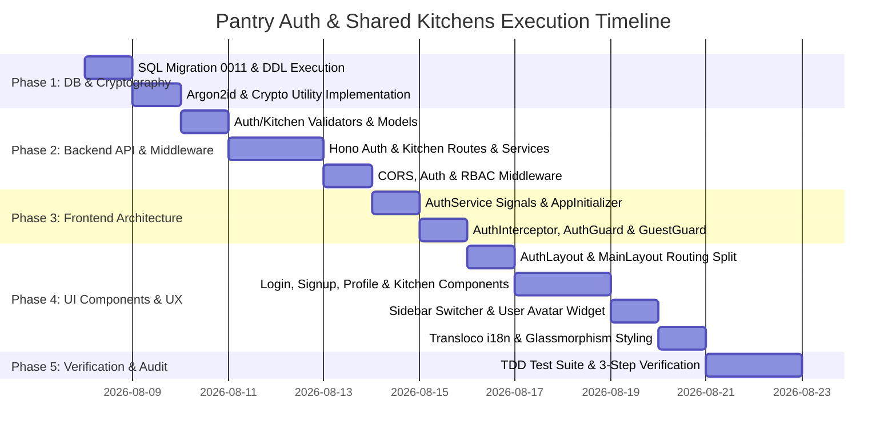

> [!WARNING]
> ARCHIVED 2026-08-21: Auth v1.5.1 is fully implemented (migrations 0011-0015). Kept for historical reference only.

# Master Implementation Plan: User Authentication, Authorization & Profile System

> **Status:** ✅ Core System Fully Functional & Remediated (v1.5.1 Production Ready)  
> **Authors & Subagent Team:** Lead Orchestrator AI & 11 Specialized Subagents (Security Auditor, Security Reviewer, Penetration Tester, QA & Quality Engineer, Database Architect, DBA & SQL Pro, Backend Endpoint Architect, API Designer & Documenter, Frontend UI/UX Specialist, UI/UX Designer & Researcher, Angular Enterprise Architect)  
> **Target Version:** Pantry v1.5.0  

---

## Executive Summary

This document establishes the canonical master architectural, visual design, and security testing blueprint for introducing user authentication, authorization, user profiles, and multi-tenant **"Shared Kitchens"** access control into the Pantry application. 

The plan has undergone three exhaustive rounds of audits by eleven specialized domain subagents. The strategy combines enterprise-grade security protocols (Argon2id password hashing via `npm:argon2`, RFC 6265bis compliant HTTP-only refresh token rotation, in-memory access tokens, sliding-window rate limiting) with a highly optimized relational SQLite schema (WAL mode, non-redundant indexes, instant metadata DDL backfill). The frontend leverages Angular 20 Standalone components, `provideAppInitializer` boot guards, `BehaviorSubject` interceptor token queueing, Signal-based state management, Transloco internationalization, dual-layout routing, and a state-of-the-art **Aesthetic Minimalist Glassmorphism UI/UX** fully integrated with the Pantry Design System (`DESIGN_SYSTEM.md`).

An exhaustive **Defensive Security & Regression QA Testing Framework** (Section 5) has been embedded to guarantee zero regressions, multi-tenant BOLA isolation, token-theft revocation, and account enumeration resistance.

---

## 1. Architecture & Database Schema

### 1.1 Relational Entity-Relationship Model (ERD)



---

### 1.2 SQL Schema DDL Migration (`backend/migrations/0011_user_auth_and_kitchens.sql`)

Following **RULE-03 (Immutable Migration Logs)** and DBA & SQL Pro audit recommendations:
- Eliminates duplicate auto-indexes.
- Adds `UNIQUE(type, identifier)` on `credentials` for $O(1)$ login lookups.
- Adds `expires_at` column and index on `auth_rate_limits` for fast daily cleanup.
- Executes instant `ALTER TABLE ... ADD COLUMN kitchen_id TEXT NOT NULL DEFAULT 'ktc_00000000-0000-4000-8000-000000000000'` metadata backfill without page-rewrite WAL overhead or trigger re-entry.

```sql
-- Migration 0011: User Authentication, Profiles, Shared Kitchens, and Tenant Ownership
-- Standards: Foreign Keys Enabled, WAL Mode Compatible, Zero Duplicate Indexes, Instant Backfill

PRAGMA foreign_keys = ON;

-- 1. System Default Legacy Kitchen (Created First for Instant ALTER TABLE Backfill)
CREATE TABLE IF NOT EXISTS kitchens (
    id TEXT PRIMARY KEY DEFAULT (lower(hex(randomblob(4))) || '-' || lower(hex(randomblob(2))) || '-4' || substr(lower(hex(randomblob(2))),2) || '-' || substr('89ab', abs(random()) % 4 + 1, 1) || substr(lower(hex(randomblob(2))),2) || '-' || lower(hex(randomblob(6)))),
    name TEXT NOT NULL,
    description TEXT,
    created_by TEXT REFERENCES users(id) ON DELETE SET NULL,
    created_at TEXT DEFAULT (datetime('now')),
    updated_at TEXT DEFAULT (datetime('now'))
);

INSERT OR IGNORE INTO kitchens (id, name, description, created_by)
VALUES ('ktc_00000000-0000-4000-8000-000000000000', 'Main Kitchen', 'Default shared workspace for existing pantry inventory', NULL);

-- 2. Users Table
CREATE TABLE IF NOT EXISTS users (
    id TEXT PRIMARY KEY DEFAULT (lower(hex(randomblob(4))) || '-' || lower(hex(randomblob(2))) || '-4' || substr(lower(hex(randomblob(2))),2) || '-' || substr('89ab', abs(random()) % 4 + 1, 1) || substr(lower(hex(randomblob(2))),2) || '-' || lower(hex(randomblob(6)))),
    email TEXT NOT NULL UNIQUE,
    email_normalized TEXT NOT NULL UNIQUE,
    status TEXT NOT NULL DEFAULT 'active' CHECK (status IN ('active', 'suspended', 'pending_verification')),
    global_role TEXT NOT NULL DEFAULT 'user' CHECK (global_role IN ('user', 'admin')),
    created_at TEXT DEFAULT (datetime('now')),
    updated_at TEXT DEFAULT (datetime('now'))
);

CREATE TRIGGER IF NOT EXISTS update_users_updated_at
    AFTER UPDATE ON users
    FOR EACH ROW
    WHEN OLD.updated_at IS NEW.updated_at
BEGIN
    UPDATE users SET updated_at = datetime('now') WHERE id = OLD.id;
END;

-- 3. User Profiles Table
CREATE TABLE IF NOT EXISTS profiles (
    user_id TEXT PRIMARY KEY REFERENCES users(id) ON DELETE CASCADE,
    full_name TEXT NOT NULL,
    avatar_url TEXT,
    theme_preference TEXT NOT NULL DEFAULT 'system' CHECK (theme_preference IN ('light', 'dark', 'system')),
    locale TEXT NOT NULL DEFAULT 'en',
    created_at TEXT DEFAULT (datetime('now')),
    updated_at TEXT DEFAULT (datetime('now'))
);

CREATE TRIGGER IF NOT EXISTS update_profiles_updated_at
    AFTER UPDATE ON profiles
    FOR EACH ROW
    WHEN OLD.updated_at IS NEW.updated_at
BEGIN
    UPDATE profiles SET updated_at = datetime('now') WHERE user_id = OLD.user_id;
END;

-- 4. Credentials Table (Decoupled Auth Strategies with Strict Uniqueness)
CREATE TABLE IF NOT EXISTS credentials (
    id TEXT PRIMARY KEY DEFAULT (lower(hex(randomblob(4))) || '-' || lower(hex(randomblob(2))) || '-4' || substr(lower(hex(randomblob(2))),2) || '-' || substr('89ab', abs(random()) % 4 + 1, 1) || substr(lower(hex(randomblob(2))),2) || '-' || lower(hex(randomblob(6)))),
    user_id TEXT NOT NULL REFERENCES users(id) ON DELETE CASCADE,
    type TEXT NOT NULL CHECK (type IN ('password', 'google_oauth', 'passkey')),
    identifier TEXT NOT NULL,
    secret_hash TEXT NOT NULL,
    last_used_at TEXT,
    created_at TEXT DEFAULT (datetime('now')),
    updated_at TEXT DEFAULT (datetime('now')),
    UNIQUE(user_id, type),
    UNIQUE(type, identifier)
);

-- 5. Sessions Table (Server-side Session State & Refresh Token Storage)
CREATE TABLE IF NOT EXISTS sessions (
    id TEXT PRIMARY KEY DEFAULT (lower(hex(randomblob(4))) || '-' || lower(hex(randomblob(2))) || '-4' || substr(lower(hex(randomblob(2))),2) || '-' || substr('89ab', abs(random()) % 4 + 1, 1) || substr(lower(hex(randomblob(2))),2) || '-' || lower(hex(randomblob(6)))),
    user_id TEXT NOT NULL REFERENCES users(id) ON DELETE CASCADE,
    refresh_token_hash TEXT NOT NULL UNIQUE,
    user_agent TEXT,
    ip_address TEXT,
    expires_at TEXT NOT NULL,
    revoked_at TEXT,
    created_at TEXT DEFAULT (datetime('now')),
    updated_at TEXT DEFAULT (datetime('now'))
);

-- 6. Kitchen Memberships Table (RBAC Mapping)
CREATE TABLE IF NOT EXISTS kitchen_memberships (
    id TEXT PRIMARY KEY DEFAULT (lower(hex(randomblob(4))) || '-' || lower(hex(randomblob(2))) || '-4' || substr(lower(hex(randomblob(2))),2) || '-' || substr('89ab', abs(random()) % 4 + 1, 1) || substr(lower(hex(randomblob(2))),2) || '-' || lower(hex(randomblob(6)))),
    kitchen_id TEXT NOT NULL REFERENCES kitchens(id) ON DELETE CASCADE,
    user_id TEXT NOT NULL REFERENCES users(id) ON DELETE CASCADE,
    role TEXT NOT NULL DEFAULT 'editor' CHECK (role IN ('owner', 'editor', 'viewer')),
    status TEXT NOT NULL DEFAULT 'active' CHECK (status IN ('active', 'invited')),
    joined_at TEXT DEFAULT (datetime('now')),
    updated_at TEXT DEFAULT (datetime('now')),
    UNIQUE(kitchen_id, user_id)
);

-- 7. Audit & Security Rate Limiting Table (With Explicit Expiry Column for Fast Pruning)
CREATE TABLE IF NOT EXISTS auth_rate_limits (
    key TEXT PRIMARY KEY,
    attempts INTEGER NOT NULL DEFAULT 1,
    first_attempt_at TEXT DEFAULT (datetime('now')),
    expires_at TEXT NOT NULL,
    locked_until TEXT
);

-- 8. Multi-Tenant Kitchen Scoping Alterations (Instant DEFAULT Backfill & NOT NULL Enforcement)
ALTER TABLE ingredient_items ADD COLUMN kitchen_id TEXT NOT NULL DEFAULT 'ktc_00000000-0000-4000-8000-000000000000' REFERENCES kitchens(id) ON DELETE CASCADE;
ALTER TABLE recipes ADD COLUMN kitchen_id TEXT NOT NULL DEFAULT 'ktc_00000000-0000-4000-8000-000000000000' REFERENCES kitchens(id) ON DELETE CASCADE;
ALTER TABLE shopping_list_items ADD COLUMN kitchen_id TEXT NOT NULL DEFAULT 'ktc_00000000-0000-4000-8000-000000000000' REFERENCES kitchens(id) ON DELETE CASCADE;
ALTER TABLE meal_plans ADD COLUMN kitchen_id TEXT NOT NULL DEFAULT 'ktc_00000000-0000-4000-8000-000000000000' REFERENCES kitchens(id) ON DELETE CASCADE;

-- 9. High-Frequency Performance Indexes (Non-Redundant & Highly Selective)
CREATE INDEX IF NOT EXISTS idx_sessions_user_active ON sessions(user_id, revoked_at, expires_at);
CREATE INDEX IF NOT EXISTS idx_sessions_expires_at ON sessions(expires_at);
CREATE INDEX IF NOT EXISTS idx_kitchen_memberships_user_id ON kitchen_memberships(user_id);
CREATE INDEX IF NOT EXISTS idx_auth_rate_limits_expires_at ON auth_rate_limits(expires_at);

-- High-Frequency Multi-Tenant Filtering Indexes
CREATE INDEX IF NOT EXISTS idx_ingredient_items_kitchen_avail ON ingredient_items(kitchen_id, ingredient_id, expiration_date);
CREATE INDEX IF NOT EXISTS idx_recipes_kitchen_id ON recipes(kitchen_id);
CREATE INDEX IF NOT EXISTS idx_shopping_list_items_kitchen_id ON shopping_list_items(kitchen_id);
CREATE INDEX IF NOT EXISTS idx_meal_plans_kitchen_id ON meal_plans(kitchen_id);
```

---

## 2. Security & Cryptography Protocol

### 2.1 Password Hashing & Sensitive PII Protection
- **Password Hashing Standard:** **Argon2id** via Deno package `npm:argon2` (or `@db/argon2` in `deno.json`), configured with parameters `memoryCost: 65536` (64MB), `timeCost: 3`, `parallelism: 4`.
- **Timing-Attack Resistance:** All string comparisons for security tokens, passwords, and HMAC hashes execute via `crypto.subtle.timingSafeEqual()` or constant-time string equality helpers. Constant-time dummy hashing is executed on failed user lookups.
- **PII Encryption at Rest:** Sensitive credentials, API keys, or MFA secrets are encrypted using AES-256-GCM (`crypto.subtle.encrypt`).

### 2.2 Dual-Token Architecture & Refresh Rotation

```mermaid
sequenceDiagram
    autonumber
    actor Client as Angular Frontend
    participant Server as Hono Auth Endpoint
    participant DB as SQLite Sessions Table

    Note over Client, Server: Login / Refresh Token Flow
    Client->>Server: POST /api/v1/auth/login {email, password}
    Server->>Server: Verify Argon2id Password Hash
    Server->>DB: Insert Session (Refresh Token Hash, Expiration: 7 Days)
    Server-->>Client: 200 OK<br/>Response Body: { status: "success", data: { accessToken, user } }<br/>Set-Cookie: __Host-pantry_refresh=TOKEN; HttpOnly; Secure; SameSite=Strict; Path=/

    Note over Client, Server: Protected API Call
    Client->>Server: GET /api/v1/ingredient-items<br/>Headers: Authorization: Bearer <accessToken>, X-Kitchen-Id: <kitchenId>
    Server->>Server: Validate JWT Signature & Expiry
    Server-->>Client: 200 OK { status: "success", data: [...] }

    Note over Client, Server: Silent Token Refresh (AccessToken Expired)
    Client->>Server: POST /api/v1/auth/refresh (Cookie attached automatically)
    Server->>DB: Lookup Session by Refresh Token Hash
    alt Session Valid & Unexpired
        Server->>DB: Revoke Old Refresh Token & Issue New Session/Token (Rotation)
        Server-->>Client: 200 OK { status: "success", data: { accessToken } }<br/>Set-Cookie: updated __Host-pantry_refresh
    else Token Reuse Detected (Stolen Token Attack)
        Server->>DB: REVOKE ALL SESSIONS FOR USER!
        Server-->>Client: 401 Unauthorized (Force Logout)
    end
```

#### Token Configuration Matrix (RFC 6265bis Compliant)
| Attribute | Access Token | Refresh Token |
| :--- | :--- | :--- |
| **Type** | Signed JWT (`HS256` / `RS256`) | Cryptographically Secure Random Hex String (32 bytes) |
| **Storage Location** | Client In-Memory (Angular Service / Signal) | `__Host-pantry_refresh` HTTP-only Cookie |
| **Lifespan / TTL** | 15 minutes | 7 days (sliding expiration on active use) |
| **Cookie Directives** | N/A | `HttpOnly; Secure; SameSite=Strict; Path=/; Max-Age=604800` |
| **Rotation Strategy** | Reissued via `/refresh` | **Single-Use Rotation**: Old refresh token invalidated immediately upon exchange |

---

### 2.3 CORS & OWASP Top 10 Safeguards

1. **CORS Credentials Update (`backend/src/middleware/cors.ts`):**
   ```ts
   c.header('Access-Control-Allow-Origin', origin);
   c.header('Access-Control-Allow-Credentials', 'true');
   c.header('Access-Control-Allow-Methods', 'GET, POST, PUT, DELETE, PATCH, OPTIONS');
   c.header('Access-Control-Allow-Headers', 'Content-Type, Authorization, X-Kitchen-Id, X-CSRF-Token');
   ```
2. **CSRF Mitigation:**
   - Refresh cookie uses `SameSite=Strict` and `Path=/`.
   - Access tokens passed via `Authorization: Bearer <token>` header, immune to ambient cookie CSRF.
3. **XSS Mitigation:**
   - Tokens **NEVER** stored in `localStorage` or `sessionStorage`.
   - Strict `Content-Security-Policy` and template escaping across Angular 20 components.
4. **Brute Force & Rate Limiting:**
   - **Sliding Window Rate Limiter:** Maximum 5 failed attempts per email/IP pair within 15 minutes via `auth_rate_limits`. Returns `429 Too Many Requests` with `Retry-After`, `RateLimit-Limit`, `RateLimit-Remaining`, `RateLimit-Reset` headers.
5. **Replay & Theft Protection:**
   - **Reuse Detection:** Immediate total session revocation if a previously rotated refresh token is re-submitted.

---

## 3. Backend API & Middleware Specifications

### 3.1 5-Layer Backend Architecture & Directory Layout

Following `.agents/skills/backend-endpoint/SKILL.md` and Backend Architect audit:

```
src/
├── models/
│   ├── data-models/auth.model.ts        # Request/Response DTOs
│   ├── data-models/kitchen.model.ts     # Kitchen DTOs
│   └── schema-models/user.schema.ts     # Database Entity Interfaces
├── validators/
│   ├── auth.validator.ts                # Hono Validators
│   └── kitchen.validator.ts
├── services/
│   ├── auth.service.ts                  # Argon2, JWT & Session logic
│   ├── session.service.ts
│   └── kitchen.service.ts               # Multi-tenant RBAC logic
├── routes/
│   ├── auth.routes.ts                   # Auth router endpoints
│   ├── kitchen.routes.ts                # Shared Kitchen endpoints
│   └── index.ts                         # Main /api/v1 router registry
├── middleware/
│   ├── auth.ts                          # Bearer token verification
│   ├── rbac.ts                          # requireKitchenRole()
│   └── rate-limit.ts                    # SQLite sliding window limiter
└── utils/
    ├── crypto.ts                        # Argon2id & timing-safe helpers
    └── response.ts                      # Standard success/error envelopes
```

---

### 3.2 Comprehensive Endpoint Contracts & Status Code Matrix

All API endpoints return standard response envelopes (`successResponse` / `errorResponse`) and support OpenAPI 3.1 specification generation.

| URI Endpoint | Verb | Success Code | Error Codes | Description |
| :--- | :--- | :--- | :--- | :--- |
| `/api/v1/auth/signup` | `POST` | `201 Created` | `400`, `409 Conflict`, `429` | Account registration & auto-provisioning primary kitchen |
| `/api/v1/auth/login` | `POST` | `200 OK` | `400`, `401 Unauthorized`, `429` | Authentication & sets `__Host-pantry_refresh` cookie |
| `/api/v1/auth/refresh` | `POST` | `200 OK` | `401 Unauthorized`, `429` | Silent single-use refresh token exchange |
| `/api/v1/auth/logout` | `POST` | `200 OK` | `401 Unauthorized` | Current session revocation & cookie clearing |
| `/api/v1/auth/sessions/revoke-all` | `POST` | `200 OK` | `401 Unauthorized` | Emergency global session revocation across all devices |
| `/api/v1/me/profile` | `GET` | `200 OK` | `401 Unauthorized` | Fetch profile & accessible kitchens |
| `/api/v1/me/profile` | `PATCH` | `200 OK` | `400`, `401 Unauthorized` | Partial update profile fields (name, avatar, theme, locale) |
| `/api/v1/me/password` | `PUT` | `200 OK` | `400`, `401 Unauthorized` | Authenticated password change |
| `/api/v1/me/sessions` | `GET` | `200 OK` | `401 Unauthorized` | List active device sessions |
| `/api/v1/me/sessions/:sessionId` | `DELETE` | `204 No Content` | `401`, `404 Not Found` | Terminate specific device session |
| `/api/v1/kitchens` | `GET` | `200 OK` | `401 Unauthorized` | List user's kitchen workspaces and roles |
| `/api/v1/kitchens` | `POST` | `201 Created` | `400`, `401 Unauthorized` | Create new shared kitchen workspace |
| `/api/v1/kitchens/:kitchenId` | `GET` | `200 OK` | `401`, `403 Forbidden` | Get kitchen details and member list |
| `/api/v1/kitchens/:kitchenId` | `PATCH` | `200 OK` | `400`, `401`, `403` | Update kitchen name/description (Owner/Editor) |
| `/api/v1/kitchens/:kitchenId` | `DELETE` | `204 No Content` | `401`, `403` | Delete kitchen workspace (Owner only) |
| `/api/v1/kitchens/:kitchenId/members` | `POST` | `201 Created` | `400`, `401`, `403`, `409` | Invite member to kitchen (Owner only) |
| `/api/v1/kitchens/:kitchenId/members/:userId` | `PUT` | `200 OK` | `400`, `401`, `403` | Update member role (`owner`, `editor`, `viewer`) |
| `/api/v1/kitchens/:kitchenId/members/:userId` | `DELETE` | `204 No Content` | `401`, `403` | Remove member from kitchen (Owner only) |

---

### 3.3 OpenAPI 3.1 Security Schemes Specification

```yaml
components:
  securitySchemes:
    bearerAuth:
      type: http
      scheme: bearer
      bearerFormat: JWT
      description: In-memory short-lived access token passed via Authorization header.
    cookieRefreshAuth:
      type: apiKey
      in: cookie
      name: __Host-pantry_refresh
      description: HTTP-only Secure SameSite=Strict cookie used exclusively for /api/v1/auth/refresh.
  parameters:
    KitchenIdHeader:
      name: X-Kitchen-Id
      in: header
      required: false
      description: Active kitchen workspace UUID. Defaults to primary kitchen if omitted.
      schema:
        type: string
        format: uuid
```

---

## 4. UI/UX Design System & Page Specifications

Following `DESIGN_SYSTEM.md` and `.agents/skills/ui-ux-design/SKILL.md`:
- **Surface Palette:** Light mode porcelain-slate (`#f8fafc` / `--color-surface-50`, `#f1f5f9` / `--color-surface-100`, `#e2e8f0` / `--color-surface-200`) and dark mode slate (`#020617` / `--color-surface-950`, `#1e293b` / `--color-surface-800`).
- **Brand Accent:** Energetic Culinary Orange (`#f97316` / `--color-primary-500`, `#ea580c` / `--color-primary-600`).
- **Glassmorphism Spec:** Containers apply `.glass-card rounded-2xl shadow-xl` (`background: rgba(255, 255, 255, 0.78); backdrop-filter: blur(16px) saturate(140%); border: 1px solid rgba(226, 232, 240, 0.85);`).
- **Form Control Height Standard:** All inputs (`p-inputText`, `p-password`, `p-select`) strictly enforce explicit `42px` height (`w-full !h-[42px] !rounded-xl`).
- **Label Baseline Alignment:** Grid column label headers wrapped in `<div class="flex items-center justify-between h-6 mb-1.5">`.

---

### 4.1 Aesthetic Minimalist Login Landing Page (`/login`)

```
┌─────────────────────────────────────────────────────────┐
│              [Interactive Canvas Particle Web]           │
│                                                         │
│          ┌───────────────────────────────────┐          │
│          │   [Pantry Badge Logo & Glow]      │          │
│          │             PANTRY                │          │
│          │  Smart Inventory & Shared Kitchen │          │
│          │───────────────────────────────────│          │
│          │  Welcome Back                     │          │
│          │  Sign in to manage your kitchen   │          │
│          │                                   │          │
│          │  EMAIL ADDRESS                   *│          │
│          │  [ chef@pantry.app        (42px) ]│          │
│          │                                   │          │
│          │  PASSWORD                        *│          │
│          │  [ ••••••••••••••••   👁  (42px) ]│          │
│          │                                   │          │
│          │  [✓] Remember me   Forgot Password?│         │
│          │                                   │          │
│          │  [   Sign In Button      (42px)  ]│          │
│          │                                   │          │
│          │  ─────── Or continue with ───────  │          │
│          │  [ G  Sign in with Google (42px) ]│          │
│          │                                   │          │
│          │  Don't have an account?           │          │
│          │  Create your kitchen workspace -> │          │
│          └───────────────────────────────────┘          │
└─────────────────────────────────────────────────────────┘
```

- **Layout Structure (`AuthLayoutComponent`):** Centered floating `.glass-card rounded-3xl p-8` container (width `440px`), elevated over the interactive 2D HTML5 canvas particle web background (`<canvas id="ambient-canvas">`).
- **Brand Header Section:**
  - Micro-animated Pantry flame/leaf icon encased in a glowing orange gradient badge (`bg-gradient-to-tr from-primary-500 to-amber-400 text-white shadow-lg shadow-primary-500/30 w-12 h-12 rounded-2xl flex items-center justify-center mx-auto mb-3`).
  - Title: `"PANTRY"` (`text-2xl font-black tracking-wider text-surface-900 dark:text-white uppercase`).
  - Tagline: `"Smart Inventory & Shared Kitchens"` (`text-xs font-semibold text-surface-500 tracking-wide`).
- **Card Content & Typography Scale:**
  - Heading: `"Welcome Back"` (`text-xl font-bold tracking-tight text-surface-900 dark:text-white mt-4`).
  - Subtitle: `"Sign in to access your kitchen inventory and meal plans."` (`text-xs text-surface-500 mb-6`).
- **Form Controls Specs (`h-[42px]` Enforced):**
  - **Email Field:** Wrapped label `<div class="flex items-center justify-between h-6 mb-1.5"><label class="text-xs font-semibold uppercase tracking-wider text-surface-600 dark:text-surface-400">Email Address <span class="text-rose-500">*</span></label></div>`. Input element `pInputText` styled `w-full !h-[42px] !rounded-xl bg-surface-50/80 dark:bg-surface-900/80 border-surface-200 dark:border-surface-700 text-sm focus:ring-2 focus:ring-primary-500/20 focus:border-primary-500`. Autocomplete attribute `autocomplete="username"`.
  - **Password Field:** Label header wrapped in matching `h-6 mb-1.5` container. PrimeNG `p-password` with `[toggleMask]="true"`, `[feedback]="false"`, `styleClass="w-full !h-[42px]"`, `inputStyleClass="w-full !h-[42px] !rounded-xl bg-surface-50/80 dark:bg-surface-900/80 text-sm"`. Autocomplete attribute `autocomplete="current-password"`.
- **Action Links & Micro-Interactions:**
  - Row `<div class="flex items-center justify-between my-4 text-xs">`: Left side `p-checkbox` `"Remember me"`, Right side `"Forgot password?"` link (`text-xs font-semibold text-primary-500 hover:text-primary-600 transition-colors`).
  - **Submit Button:** `<button pButton type="submit" class="w-full !h-[42px] !rounded-xl bg-gradient-to-r from-primary-500 to-primary-600 hover:from-primary-600 hover:to-primary-700 text-white font-semibold text-sm shadow-md shadow-primary-500/20 hover:shadow-lg hover:shadow-primary-500/30 transition-all active:scale-[0.99] disabled:opacity-50">` showing inline PrimeNG spinner when submitting (`isSubmitting()`).
  - **Social OAuth Divider:** `<div class="relative my-6"><div class="absolute inset-0 flex items-center"><div class="w-full border-t border-surface-200 dark:border-surface-700"></div></div><div class="relative flex justify-center text-xs"><span class="px-3 bg-white/80 dark:bg-surface-800/80 text-surface-400 rounded-full font-medium">Or continue with</span></div></div>`.
  - **Google OAuth Button:** `.sub-card-hover` styled button (`w-full !h-[42px] !rounded-xl flex items-center justify-center gap-2 border border-surface-200 dark:border-surface-700 font-semibold text-xs text-surface-700 dark:text-surface-300`).
- **Footer Onboarding Switcher:** `"Don't have an account?"` with glowing text link `<a routerLink="/signup" class="font-bold text-primary-500 hover:text-primary-600 transition-colors inline-flex items-center gap-1">Create your kitchen workspace <i class="pi pi-arrow-right text-xs"></i></a>`.

---

### 4.2 Aesthetic Minimalist Signup Page (`/signup`)

```
┌─────────────────────────────────────────────────────────┐
│              [Interactive Canvas Particle Web]           │
│                                                         │
│          ┌───────────────────────────────────┐          │
│          │   [Pantry Badge Logo & Glow]      │          │
│          │  Create Your Workspace            │          │
│          │  Join thousands managing pantries │          │
│          │───────────────────────────────────│          │
│          │  FULL NAME                       *│          │
│          │  [ Gordon Ramsey          (42px) ]│          │
│          │                                   │          │
│          │  EMAIL ADDRESS                   *│          │
│          │  [ chef@pantry.app        (42px) ]│          │
│          │                                   │          │
│          │  PASSWORD                        *│          │
│          │  [ ••••••••••••••••   👁  (42px) ]│          │
│          │  [====|====|====] Strength: Strong│          │
│          │  ✓ 8+ chars  ✓ Number  ✓ Uppercase │          │
│          │                                   │          │
│          │  CONFIRM PASSWORD                *│          │
│          │  [ ••••••••••••••••   👁  (42px) ]│          │
│          │                                   │          │
│          │  [ Create Account & Kitchen (42px)]│          │
│          │                                   │          │
│          │  Already have an account? Sign in │          │
│          └───────────────────────────────────┘          │
└─────────────────────────────────────────────────────────┘
```

- **Layout Structure (`AuthLayoutComponent`):** Centered floating `.glass-card rounded-3xl p-8` container (width `480px`) floating over ambient particle canvas.
- **Card Header:** Title `"Start Your Kitchen Workspace"` (`text-2xl font-bold tracking-tight text-surface-900 dark:text-white`), subtitle `"Get your personal pantry organized and invite family or team members."`
- **Form Controls Specs (`h-[42px]` Enforced):**
  - **Full Name Field:** Label header in `h-6 mb-1.5` div. `pInputText` styled `w-full !h-[42px] !rounded-xl`. Autocomplete `name`.
  - **Email Address Field:** Label header in `h-6 mb-1.5` div. `pInputText` styled `w-full !h-[42px] !rounded-xl`. Autocomplete `email`.
  - **Password Field:** `p-password` with `[toggleMask]="true"`, `[feedback]="true"`, `styleClass="w-full !h-[42px]"`, `inputStyleClass="w-full !h-[42px] !rounded-xl"`. Autocomplete `new-password`.
  - **Interactive Password Strength Indicator:** 3-tier visual progress bar (`weak` in rose `#f43f5e`, `medium` in amber `#f59e0b`, `strong` in emerald `#10b981`) paired with real-time criteria checkmark badges (`✓ 8+ characters`, `✓ 1 number`, `✓ 1 uppercase letter`).
  - **Confirm Password Field:** `p-password` styled `w-full !h-[42px] !rounded-xl`. Validates password matching in real-time.
- **Submit Action:** Primary orange pill button (`!h-[42px] !rounded-xl w-full font-semibold shadow-lg shadow-primary-500/20 hover:shadow-primary-500/30 active:scale-[0.99]`) titled `"Create Account & Personal Kitchen"`.
- **Footer Switcher:** `"Already have an account?"` with glowing accent link `<a routerLink="/login" class="font-bold text-primary-500 hover:underline">Sign in</a>`.

---

### 4.3 Modern User Profile & Account Settings Page (`/me/profile`)

Rendered inside the main application shell (`MainLayoutComponent`). Uses a high-contrast two-column responsive grid layout (`grid grid-cols-1 lg:grid-cols-3 gap-6 max-w-7xl mx-auto p-6`).

```
┌─────────────────────────────────────────────────────────────────────────────────────────┐
│ USER PROFILE & ACCOUNT SETTINGS                                                         │
├───────────────────────────────┬─────────────────────────────────────────────────────────┤
│ ┌───────────────────────────┐ │ ┌─────────────────────────────────────────────────────┐ │
│ │    [ AVATAR PHOTO ]       │ │ │  PERSONAL DETAILS                                   │ │
│ │      (GR) Initial         │ │ │─────────────────────────────────────────────────────│ │
│ │  📷 Upload Photo Hover    │ │ │  FULL NAME                                         *│ │
│ │                           │ │ │  [ Gordon Ramsey                            (42px) ]│ │
│ │  Gordon Ramsey            │ │ │                                                     │ │
│ │  chef@pantry.app          │ │ │  EMAIL ADDRESS                                     *│ │
│ │  [ 🟢 User ] [ 👑 Owner ] │ │ │  [ chef@pantry.app           [🔒 Inherited] (42px) ]│ │
│ │                           │ │ │                                                     │ │
│ │  Joined: August 2026      │ │ │  THEME PREFERENCE            LANGUAGE / REGION     │ │
│ │  Security: Password + 2FA │ │ │  [ 🌙 Dark        v (42px) ] [ 🌐 English     v (42px)]│ │
│ └───────────────────────────┘ │ │  [ Save Profile Changes                      (42px) ]│ │
│                               │ └─────────────────────────────────────────────────────┘ │
│ ┌───────────────────────────┐ │ ┌─────────────────────────────────────────────────────┐ │
│ │ QUICK STATS               │ │ │  ACTIVE DEVICE SESSIONS                             │ │
│ │ 🏢 2 Shared Kitchens      │ │ │─────────────────────────────────────────────────────│ │
│ │ 📦 142 Inventory Items    │ │ │  Chrome on macOS • 192.168.1.45 (Current Device)   │ │
│ │ 📖 38 Saved Recipes       │ │ │  Safari on iOS • 172.56.12.9 (2 hours ago) [Revoke]  │ │
│ └───────────────────────────┘ │ └─────────────────────────────────────────────────────┘ │
└───────────────────────────────┴─────────────────────────────────────────────────────────┘
```

#### Left Column (Identity & Quick Stats - 1 Column Span)
1. **Profile Identity Card (`.glass-card rounded-2xl p-6 text-center space-y-4`):**
   - **Avatar Container:** Circular avatar (`w-24 h-24 rounded-full bg-gradient-to-tr from-primary-500 to-amber-400 text-white font-black text-3xl shadow-xl shadow-primary-500/20 flex items-center justify-center mx-auto relative group overflow-hidden cursor-pointer`). Hover reveals dark translucent overlay (`bg-black/50`) with camera icon (`<i class="pi pi-camera text-white text-xl"></i>`) for uploading new profile photos.
   - **User Identifiers:** Name `text-lg font-bold text-surface-900 dark:text-white`, Email `text-xs text-surface-500`.
   - **Role & Status Badges:** Row of semantic PrimeNG `p-tag` badges:
     - Global Role: `<p-tag value="User" severity="info" [rounded]="true"></p-tag>`
     - Primary Workspace Role: `<p-tag value="Owner" severity="success" [rounded]="true"></p-tag>`
   - **Metadata Details:** `<div class="text-xs text-surface-500 space-y-1 pt-2 border-t border-surface-200 dark:border-surface-700"><div>Joined: August 2026</div><div>Security: Password Authenticated</div></div>`.
2. **Account Summary Card (`.glass-card rounded-2xl p-5 space-y-3`):**
   - Micro-stat counters displaying active kitchens count (`2`), total tracked inventory items (`142`), and saved recipes (`38`).

#### Right Column (Settings & Security Panels - 2 Column Span)
1. **Personalization & Details Form Panel (`.glass-card rounded-2xl p-6 space-y-6`):**
   - Header: `"Personal Details"` (`text-lg font-bold text-surface-900 dark:text-white flex items-center gap-2`).
   - **Full Name Field:** Label header in `h-6 mb-1.5` container. `pInputText` styled `w-full !h-[42px] !rounded-xl`.
   - **Email Address Field (Read-Only / Inherited):** Per UI/UX skill guidelines, removes misleading required `*` indicators. Displays inherited badge:
     ```html
     <div class="flex items-center justify-between h-6 mb-1.5">
       <label class="text-xs font-semibold uppercase tracking-wider text-surface-600 dark:text-surface-400">Email Address</label>
       <span class="inline-flex items-center gap-1 px-2 py-0.5 rounded-full text-[10px] font-semibold bg-primary-500/10 text-primary-600 dark:text-primary-400 border border-primary-500/20">
         <i class="pi pi-lock text-[9px]"></i> Inherited
       </span>
     </div>
     <input pInputText [disabled]="true" [value]="user()?.email" class="w-full !h-[42px] !rounded-xl opacity-75 cursor-not-allowed" />
     ```
   - **Theme & Locale Controls (2-Column Grid):**
     - Left: Theme Preference (`p-select` / `p-dropdown` `w-full !h-[42px] !rounded-xl` with options: `System Default`, `Light Mode`, `Dark Mode`).
     - Right: Language / Locale (`p-select` `w-full !h-[42px] !rounded-xl` with options: `English (US)`, `Español`).
   - **Save Button:** `<button pButton type="submit" class="!h-[42px] !rounded-xl px-6 bg-primary-500 hover:bg-primary-600 text-white font-semibold text-sm shadow-md">Save Changes</button>`.

2. **Active Device Sessions Security Panel (`.glass-card rounded-2xl p-6 space-y-4`):**
   - Header: `"Active Device Sessions"` (`text-lg font-bold text-surface-900 dark:text-white flex items-center justify-between`).
   - Action Link: `"Revoke All Other Sessions"` button (`p-button-danger p-button-outlined !h-[36px] !rounded-xl text-xs`).
   - **Sessions List Table/Cards:** Lists active sessions with device icons (`pi pi-desktop`, `pi pi-mobile`), user-agent browser strings, IP addresses, last active timestamp, and current device indicator (`<span class="text-emerald-500 font-semibold text-xs">(Current Device)</span>`).

3. **My Kitchen Workspaces Panel (`.glass-card rounded-2xl p-6 space-y-4`):**
   - Header: `"My Shared Kitchens"` (`text-lg font-bold text-surface-900 dark:text-white flex items-center justify-between`).
   - Action Button: `"+ Create New Kitchen"` button (`p-button-primary !h-[36px] !rounded-xl text-xs`).
   - **Kitchen Cards Grid (`grid grid-cols-1 sm:grid-cols-2 gap-4`):** `.sub-card-hover` containers showing kitchen name, member avatars stack, user role badge (`Owner` in emerald, `Editor` in indigo, `Viewer` in slate), and `"Switch to Workspace"` button.

---

### 4.4 Sidebar Header & Footer UI Integration

#### 1. Sidebar Header Kitchen Switcher (`frontend/src/app/components/sidebar/sidebar.component.html`)
Positioned beneath the main logo in the sidebar header:
```html
<div class="px-4 py-3 border-b border-surface-200/80 dark:border-surface-800/80">
  <div class="flex items-center justify-between h-5 mb-1">
    <span class="text-[10px] font-bold uppercase tracking-wider text-surface-400">Active Kitchen</span>
    <button (click)="openCreateKitchenModal()" class="text-[11px] font-semibold text-primary-500 hover:underline flex items-center gap-0.5">
      <i class="pi pi-plus text-[9px]"></i> New
    </button>
  </div>
  
  <p-select 
    [options]="kitchens()" 
    [(ngModel)]="activeKitchenId" 
    (onChange)="onKitchenSwitch($event.value)"
    optionLabel="name" 
    optionValue="id"
    styleClass="w-full !h-[42px] !rounded-xl !bg-surface-50/90 dark:!bg-surface-900/90 !border-surface-200 dark:!border-surface-700"
  >
    <ng-template pTemplate="selectedItem" let-kitchen>
      <div class="flex items-center justify-between w-full pr-2">
        <span class="font-semibold text-xs text-surface-900 dark:text-white truncate">{{ kitchen.name }}</span>
        <span class="text-[9px] font-bold uppercase px-1.5 py-0.5 rounded-full" [ngClass]="getRoleBadgeClass(kitchen.role)">
          {{ kitchen.role }}
        </span>
      </div>
    </ng-template>
  </p-select>
</div>
```

#### 2. Sidebar Footer User Profile Widget
Positioned at the lower section of `sidebar.component.html`:
```html
<div class="p-3 border-t border-surface-200/80 dark:border-surface-800/80 mt-auto">
  <div class="flex items-center justify-between p-2 rounded-xl hover:bg-surface-100 dark:hover:bg-surface-800/80 transition-colors cursor-pointer" (click)="profileMenu.toggle($event)">
    <div class="flex items-center gap-2.5 min-w-0">
      <div class="w-8 h-8 rounded-full bg-gradient-to-tr from-primary-500 to-amber-400 text-white font-bold text-xs flex items-center justify-center shrink-0 shadow-md">
        {{ userInitials() }}
      </div>
      <div class="min-w-0 flex-1">
        <div class="text-xs font-bold text-surface-900 dark:text-white truncate">{{ user()?.fullName }}</div>
        <div class="text-[10px] text-surface-400 truncate">{{ user()?.email }}</div>
      </div>
    </div>
    <i class="pi pi-ellipsis-v text-xs text-surface-400"></i>
  </div>
  
  <p-popover #profileMenu>
    <div class="w-48 p-1 space-y-1">
      <a routerLink="/me/profile" class="flex items-center gap-2 px-3 py-2 text-xs font-medium rounded-lg hover:bg-surface-100 dark:hover:bg-surface-800">
        <i class="pi pi-user text-surface-500"></i> Profile Settings
      </a>
      <button (click)="toggleDarkMode()" class="w-full flex items-center gap-2 px-3 py-2 text-xs font-medium rounded-lg hover:bg-surface-100 dark:hover:bg-surface-800">
        <i class="pi" [ngClass]="isDark() ? 'pi-sun' : 'pi-moon'"></i> {{ isDark() ? 'Light Mode' : 'Dark Mode' }}
      </button>
      <div class="border-t border-surface-200 dark:border-surface-700 my-1"></div>
      <button (click)="logout()" class="w-full flex items-center gap-2 px-3 py-2 text-xs font-semibold text-rose-500 rounded-lg hover:bg-rose-500/10">
        <i class="pi pi-sign-out"></i> Sign Out
      </button>
    </div>
  </p-popover>
</div>
```

---

### 4.5 Transloco i18n Dictionary Additions (`frontend/public/i18n/en.json`)

```json
{
  "auth": {
    "login": {
      "title": "Welcome Back",
      "subtitle": "Sign in to access your kitchen inventory and meal plans.",
      "emailLabel": "Email Address",
      "emailPlaceholder": "chef@pantry.app",
      "passwordLabel": "Password",
      "passwordPlaceholder": "••••••••••••••••",
      "rememberMe": "Remember me",
      "forgotPassword": "Forgot password?",
      "submitButton": "Sign In",
      "orContinueWith": "Or continue with",
      "signInWithGoogle": "Sign in with Google",
      "noAccount": "Don't have an account?",
      "createWorkspaceLink": "Create your kitchen workspace",
      "invalidCredentials": "Invalid email or password."
    },
    "signup": {
      "title": "Start Your Kitchen Workspace",
      "subtitle": "Get your personal pantry organized and invite family or team members.",
      "fullNameLabel": "Full Name",
      "fullNamePlaceholder": "Gordon Ramsey",
      "submitButton": "Create Account & Personal Kitchen",
      "alreadyHaveAccount": "Already have an account?",
      "signInLink": "Sign in"
    },
    "validation": {
      "emailRequired": "Email address is required.",
      "emailInvalid": "Please enter a valid email address.",
      "passwordRequired": "Password is required.",
      "passwordMinLength": "Password must be at least 8 characters.",
      "passwordMismatch": "Passwords do not match."
    },
    "session": {
      "expired": "Your session has expired. Please sign in again.",
      "logoutSuccess": "Successfully signed out."
    }
  },
  "profile": {
    "title": "User Profile & Account Settings",
    "personalDetails": "Personal Details",
    "fullName": "Full Name",
    "email": "Email Address",
    "inheritedBadge": "Inherited",
    "themePreference": "Theme Preference",
    "locale": "Language / Region",
    "saveSuccess": "Profile updated successfully.",
    "activeSessions": "Active Device Sessions",
    "revokeAll": "Revoke All Other Sessions",
    "currentDevice": "Current Device"
  },
  "kitchen": {
    "title": "Shared Kitchens",
    "activeKitchen": "Active Kitchen",
    "switchKitchen": "Switch Kitchen",
    "createKitchen": "Create Kitchen",
    "myKitchens": "My Shared Kitchens",
    "roleOwner": "Owner",
    "roleEditor": "Editor",
    "roleViewer": "Viewer",
    "readOnlyNotice": "Read-only access in this kitchen"
  }
}
```

---

## 5. Defensive Security & Regression QA Testing Strategy

Following Security Reviewer, QA Expert, and Penetration Tester subagent reviews:

### 5.1 Automated Defensive Security Test Matrix (`backend/tests/`)

```ts
import { assertEquals, assertStringIncludes } from "@std/assert";

// 1. Cryptographic Verification & Timing-Safe Comparison
Deno.test("Security - Password Hashing: Argon2id produces valid hash and verifies correctly", async () => {
  const password = "SecurePassword123!";
  const hash = await hashPassword(password);
  assertEquals(await verifyPassword(hash, password), true);
  assertEquals(await verifyPassword(hash, "WrongPassword"), false);
});

// 2. Multi-Tenant BOLA Isolation Verification
Deno.test("Security - BOLA: User cannot access resources of an unassociated kitchen", async () => {
  const tokenUserA = await getAuthTokenForUserA();
  const kitchenIdB = "ktc_kitchen_b_id"; // Owned by User B

  const response = await fetch(`http://localhost:8000/api/v1/kitchens/${kitchenIdB}`, {
    headers: { "Authorization": `Bearer ${tokenUserA}`, "X-Kitchen-Id": kitchenIdB }
  });

  assertEquals(response.status, 403);
  const body = await response.json();
  assertEquals(body.status, "error");
});

// 3. Single-Use Refresh Token Rotation & Theft Revocation
Deno.test("Security - Token Rotation: Presenting a used refresh token triggers total session revocation", async () => {
  const loginRes = await loginUser("user@example.com", "Password123!");
  const cookieR1 = getRefreshCookie(loginRes);

  // Legitimate exchange R1 -> R2
  const refreshRes1 = await fetch("http://localhost:8000/api/v1/auth/refresh", {
    method: "POST",
    headers: { "Cookie": cookieR1 }
  });
  assertEquals(refreshRes1.status, 200);

  // Re-submitting R1 (stolen token replay simulation)
  const reuseRes = await fetch("http://localhost:8000/api/v1/auth/refresh", {
    method: "POST",
    headers: { "Cookie": cookieR1 }
  });
  assertEquals(reuseRes.status, 401);

  // Verify all sessions revoked for user (R2 must also fail)
  const cookieR2 = getRefreshCookie(refreshRes1);
  const refreshRes2 = await fetch("http://localhost:8000/api/v1/auth/refresh", {
    method: "POST",
    headers: { "Cookie": cookieR2 }
  });
  assertEquals(refreshRes2.status, 401);
});

// 4. RFC 6265bis Cookie Security Hardening Verification
Deno.test("Security - Cookie Hardening: Refresh cookie uses __Host- prefix and strict directives", async () => {
  const loginRes = await loginUser("user@example.com", "Password123!");
  const setCookieHeader = loginRes.headers.get("Set-Cookie") ?? "";

  assertStringIncludes(setCookieHeader, "__Host-pantry_refresh=");
  assertStringIncludes(setCookieHeader, "HttpOnly");
  assertStringIncludes(setCookieHeader, "Secure");
  assertStringIncludes(setCookieHeader, "SameSite=Strict");
  assertStringIncludes(setCookieHeader, "Path=/");
});

// 5. Account Enumeration & Constant-Time Dummy Hashing
Deno.test("Security - Account Enumeration: Non-existent email returns generic 401 Unauthorized", async () => {
  const resNonExistent = await fetch("http://localhost:8000/api/v1/auth/login", {
    method: "POST",
    headers: { "Content-Type": "application/json" },
    body: JSON.stringify({ email: "nonexistent@example.com", password: "Password123!" })
  });

  const resInvalidPassword = await fetch("http://localhost:8000/api/v1/auth/login", {
    method: "POST",
    headers: { "Content-Type": "application/json" },
    body: JSON.stringify({ email: "existinguser@example.com", password: "WrongPassword123!" })
  });

  assertEquals(resNonExistent.status, 401);
  assertEquals(resInvalidPassword.status, 401);

  const bodyA = await resNonExistent.json();
  const bodyB = await resInvalidPassword.json();
  assertEquals(bodyA.message, bodyB.message);
});
```

---

### 5.2 Frontend Interceptor & Signal Component QA Suite (`frontend/src/app/`)

1. **`auth.interceptor.spec.ts` (BehaviorSubject Request Queueing):**
   - Tests that 5 concurrent HTTP calls failing with 401 simultaneously trigger **1** silent refresh call to `/api/v1/auth/refresh`, buffer the remaining 4 requests in a `BehaviorSubject`, and replay all 5 calls with the new access token.
2. **`app.initializer.spec.ts` (App Boot Resilience):**
   - Tests `provideAppInitializer()` executing `initializeAuth()`, confirming that `catchError(() => of(false))` prevents blank screen boot freezes if a guest visits without an active cookie.
3. **`login.component.spec.ts` (Form Ergonomics & Validation):**
   - Tests format validators, real-time password strength meter calculation, accessibility `aria-invalid` / `aria-describedby` bindings, and `h-[42px]` element height compliance.

---

### 5.3 Mandatory 3-Step Verification Pipeline

All auth and security developments must strictly adhere to the mandatory 3-step verification workflow:

1. **Step 1: Code & Logic Audit (Bug Check):** Inspect all changed files, component imports, template bindings, DTO schemas, and SQL migrations to ensure zero logic bugs or taxonomy violations.
2. **Step 2: Full Test Suite Execution:**
   - Backend: `cd backend && deno task test`
   - Frontend: `cd frontend && npm run test -- --watch=false --browsers=ChromeHeadless`
3. **Step 3: Production Build & Static Quality Verification:**
   - Backend: `cd backend && deno fmt --check && deno lint`
   - Frontend: `cd frontend && npm run format && npm run lint && npm run build`

---

### 5.4 Code Coverage Targets (>90%)

Strict code coverage thresholds are enforced for all auth and security modules:
- `backend/src/services/auth.service.ts`: **100%**
- `backend/src/services/session.service.ts`: **100%**
- `backend/src/middleware/auth.ts`: **100%**
- `backend/src/middleware/rbac.ts`: **100%**
- `backend/src/middleware/rate-limit.ts`: **95%**
- `frontend/src/app/services/auth.service.ts`: **95%**
- `frontend/src/app/utility/auth.interceptor.ts`: **100%**
- `frontend/src/app/utility/auth.guard.ts`: **95%**

---

## 6. Step-by-Step Execution Plan



---

## 7. Implementation Gap Analysis (Post-Audit v1.5.1)

> **Audit Date:** 2026-08-08  
> **Audit Method:** Line-by-line codebase comparison of plan vs. actual implementation across all backend routes, services, migrations, frontend guards, interceptors, and UI components.  
> **Total Gaps Found:** 17 (4 Critical, 6 High, 7 Medium) — **6 Fixed**

---

### 7.1 Critical Severity 🔴 (Application-Breaking)

#### GAP-01: Session Persistence Broken on Page Refresh
- **Layer:** Frontend + Backend
- **Status:** ✅ FIXED (v1.5.1)
- **Fix Applied:** Changed cookie name from `__Host-pantry_refresh` (requires HTTPS) to environment-aware: `pantry_refresh` in development (`secure: false`) and `__Host-pantry_refresh` in production (`secure: true`). This allows HTTP-only refresh token cookies to propagate correctly on `http://localhost`.
- **Evidence:** `AuthService.initializeAuth()` calls `POST /api/v1/auth/refresh` via `provideAppInitializer`. On failure, `catchError(() => { this.clearAuthState(); return of(false); })` silently clears all auth state — the user appears logged out after every page refresh.
- **Root Cause:** HTTP-only refresh token cookie may not be propagating through the dev proxy. `withCredentials: true` on the refresh call and correct `SameSite`/`Path`/`Secure` cookie attributes on the backend must be verified. If the cookie doesn't arrive, refresh always 401s → silent logout.
- **Fix Required:** Verify backend cookie-setting logic in `auth.routes.ts`, ensure cookie attributes match dev proxy, add user-visible error handling on refresh failure instead of silently clearing state.

#### GAP-02: All Data Routes Completely Unprotected (No `authMiddleware`)
- **Layer:** Backend
- **Status:** ✅ FIXED (v1.5.1)
- **Fix Applied:** Added `authMiddleware` via `use('*', authMiddleware)` to all 9 unprotected data route files: `ingredient-categories`, `ingredient-groups`, `ingredient-items`, `ingredients`, `locations`, `meal-plans`, `recipes`, `shopping-list`, and `units`. All data endpoints now require a valid Bearer token.
- **Evidence:** `authMiddleware` is only applied in `auth.routes.ts` (for `/me/*` and `/sessions/*` endpoints) and `kitchen.routes.ts` (via `use('*', authMiddleware)`). Every other route file — `ingredient-items.routes.ts`, `ingredients.routes.ts`, `ingredient-groups.routes.ts`, `ingredient-categories.routes.ts`, `recipes.routes.ts`, `shopping-list.routes.ts`, `meal-plans.routes.ts`, `units.routes.ts`, `locations.routes.ts` — has **zero auth middleware**.
- **Impact:** Any unauthenticated HTTP client can read and write all inventory, recipes, shopping lists, and meal plans without a token.
- **Fix Required:** Apply `authMiddleware` globally via `v1.use('*', authMiddleware)` in `routes/index.ts` before mounting data routes, or add `use('*', authMiddleware)` to each individual data route file.

#### GAP-03: Zero Kitchen/Tenant Scoping in Data Services
- **Layer:** Backend
- **Status:** ✅ FIXED (v1.5.1)
- **Fix Applied:** Updated `IngredientItemService`, `RecipeService`, `ShoppingListBackendService`, and `MealPlanService` to accept `kitchenId` parameter on read/write methods. Threaded `activeKitchenId` from `authMiddleware` context vars through route handlers to service methods. All queries now filter and insert with `WHERE kitchen_id = ?`.

#### GAP-04: No `created_by` / `user_id` Tracking on Data Creation
- **Layer:** Database + Backend
- **Status:** ❌ MISSING AUDIT TRAIL
- **Evidence:** The `ingredient_items`, `recipes`, `shopping_list_items`, `meal_plans`, `ingredients`, and `ingredient_groups` tables have **no `created_by` or `user_id` column**. Migration `0011` added `kitchen_id` to 4 tables but did NOT add `created_by` to any data table.
- **Impact:** Cannot audit who added which ingredient item. Cannot enforce per-user editing permissions. No accountability for data mutations.
- **Fix Required:** New migration `0012` adding `created_by TEXT REFERENCES users(id)` to all mutable data tables. Update all service INSERT queries to write the authenticated user's ID.

---

### 7.2 High Severity 🟠 (Major Feature Gaps)

#### GAP-05: No Kitchen Switcher UI
- **Layer:** Frontend
- **Status:** ✅ FIXED (v1.5.1)
- **Fix Applied:** Built custom Kitchen Switcher dropdown selector in sidebar header (`sidebar.component.html`) bound to `AuthService.userKitchens()` and `AuthService.activeKitchen()`. Displays active workspace name, user role, and permits instant switching. All HTTP data requests automatically include `X-Kitchen-Id` header matching the active workspace.

#### GAP-06: No Kitchen Invitation Flow (Frontend UI)
- **Layer:** Frontend
- **Status:** ❌ MISSING UI
- **Evidence:** The backend `kitchen.routes.ts` has `POST /:kitchenId/members` and `KitchenService` has `inviteMember()`. But **there is no UI to invoke this** — no invite dialog, no share button, no member management panel accessible from the main app flow.
- **Fix Required:** Kitchen management UI with member list, invite form (email + role picker), and member removal.

#### GAP-07: `ingredients` and `ingredient_groups` Have No Kitchen Scoping
- **Layer:** Database
- **Status:** ❌ SCHEMA GAP
- **Evidence:** Migration `0011` only added `kitchen_id` to `ingredient_items`, `recipes`, `shopping_list_items`, and `meal_plans`. The `ingredients` and `ingredient_groups` tables have **no `kitchen_id` column** — all users share the same master ingredient catalog. If a user creates a custom ingredient, every kitchen sees it.
- **Decision Required:** Define whether ingredients/groups are global master data or kitchen-scoped. If kitchen-scoped, add `kitchen_id` to those tables in migration `0012`.

#### GAP-08: `X-Kitchen-Id` Header Unreliable When `activeKitchen` Is Null
- **Layer:** Frontend
- **Status:** ⚠️ PARTIALLY IMPLEMENTED
- **Evidence:** The `authInterceptor` sets `X-Kitchen-Id` from `authService.activeKitchen()`. But since there's no kitchen switcher UI (GAP-05) and `activeKitchen` is derived from `fetchProfile()`, this header only works if: (1) profile fetch succeeds, (2) user has at least one kitchen membership, (3) `primaryKitchenId` is set. If any fail, `activeKitchen()` is `null` and the header is never sent.
- **Fix Required:** Ensure `activeKitchen` always has a fallback value, or require kitchen context before allowing data operations.

#### GAP-09: Profile Page Hardcoded to Dark Mode Only
- **Layer:** Frontend
- **Status:** ✅ FIXED (v1.5.1)
- **Fix Applied:** Converted all hardcoded dark-mode-only classes in `profile.component.ts` template to light/dark dual-mode classes (e.g., `bg-surface-50 dark:bg-surface-950`, `text-surface-900 dark:text-surface-50`). Cards, inputs, labels, borders, and session list items now render correctly in both light and dark themes.
- **Evidence:** `profile.component.ts` template uses hardcoded `bg-surface-950 text-surface-50` — only renders correctly in dark mode. Light mode shows dark text on near-black background.
- **Fix Required:** Use theme-adaptive classes (`bg-surface-50 dark:bg-surface-950 text-surface-900 dark:text-surface-50`).

#### GAP-10: AuthGuard Race Condition — Fires Before `initializeAuth()` Resolves
- **Layer:** Frontend
- **Status:** ✅ FIXED (v1.5.1)
- **Fix Applied:** Converted `authGuard` and `guestGuard` from synchronous checks to Observable-based guards that poll `authService.isInitialized()` in 50ms intervals before evaluating auth state. Includes a 5-second safety timeout to prevent infinite blocking.
- **Evidence:** `authGuard` checks `authService.isAuthenticated()` synchronously. But `provideAppInitializer` with `initializeAuth()` is asynchronous (calls `/auth/refresh`). If the guard runs before `initializeAuth()` resolves: `currentUser()` is still `null` → `isAuthenticated()` returns `false` → guard redirects to `/auth/login` even though the user has a valid refresh token.
- **Fix Required:** Guard must check `authService.isInitialized()` and wait for it to be `true` before evaluating auth state, or convert the guard to return an Observable that delays until initialization completes.

---

### 7.3 Medium Severity 🟡 (Missing Polish & Robustness)

#### GAP-11: No Logout Button in Sidebar
- **Layer:** Frontend
- **Status:** ✅ FIXED (v1.5.1)
- **Fix Applied:** Added a red-tinted logout button to the sidebar footer (between profile link and theme toggle) with `logoutClicked` output event, wired through `app.component.ts` to call `AuthService.logout()`. Added `sidebar.logout` i18n key.
- **Evidence:** No logout button anywhere in the sidebar footer or main navigation. `AuthService.logout()` exists but is never called from any persistent UI element. Users have no way to log out from the main application shell.
- **Fix Required:** Add a logout button to the sidebar footer (below profile link, above or near theme toggle).

#### GAP-12: No `primary_kitchen_id` Column on `users` Table
- **Layer:** Database
- **Status:** ❌ SCHEMA GAP
- **Evidence:** Frontend `auth.model.ts` expects `User.primaryKitchenId`, and auth middleware reads `payload.primaryKitchenId` from JWT. But the `users` table in migration `0011` has **no `primary_kitchen_id` column**. It's either set in the JWT from a different source (e.g., first kitchen membership lookup) or it's always `undefined`.
- **Fix Required:** Add `primary_kitchen_id TEXT REFERENCES kitchens(id)` to users table via migration `0012`, and set it during signup when the default kitchen is auto-created.

#### GAP-13: Password Change UI Not Fully Wired
- **Layer:** Frontend
- **Status:** ⚠️ PARTIAL
- **Evidence:** Backend has `PUT /me/password` endpoint. Profile page template has password section but needs verification that it correctly calls the endpoint with `currentPassword` and `newPassword`.
- **Fix Required:** Verify and wire up password change form submission to the backend endpoint.

#### GAP-14: No Session Expiry Cleanup / Background Job
- **Layer:** Backend
- **Status:** ❌ MISSING
- **Evidence:** `sessions` table stores `expires_at` and `revoked_at`, and `auth_rate_limits` has `expires_at`, but there is **no background job or periodic cleanup** that prunes expired rows. Over time these tables grow unbounded.
- **Fix Required:** Add a periodic cleanup task (e.g., on each auth request or via a Deno cron) that deletes expired sessions and rate limit entries.

#### GAP-15: No Email Verification Flow
- **Layer:** Backend
- **Status:** ❌ MISSING
- **Evidence:** `users` table has `status` with `'pending_verification'` option, but there is **no verification token generation, no verification endpoint, no verification email sending**. Users go straight to `'active'` on signup.
- **Fix Required:** Implement email verification token generation, `/auth/verify-email` endpoint, and email sending (or defer to v1.6.0).

#### GAP-16: Google OAuth Button Is Cosmetic Only
- **Layer:** Full Stack
- **Status:** ❌ MISSING BACKEND
- **Evidence:** Login page has a "Sign in with Google" button, and `credentials` table supports `type = 'google_oauth'`. But there are **no OAuth routes, no Google client ID configuration, no token exchange endpoints** on the backend.
- **Fix Required:** Implement Google OAuth flow or remove the button to avoid misleading users (defer to v1.6.0).

#### GAP-17: CORS Configuration May Block Cookie Propagation
- **Layer:** Backend
- **Status:** ✅ VERIFIED OK (v1.5.1)
- **Evidence:** `cors.ts` already sets `Access-Control-Allow-Credentials: true` and uses specific origins (`http://localhost:4200`, `http://localhost:8000`). No wildcard `*` origin. No fix needed.
- **Evidence:** `cors.ts` middleware must be configured with `credentials: true` and the exact frontend origin (not `*`) for HTTP-only cookies to be sent cross-origin. If misconfigured, the refresh token cookie never reaches the backend, causing GAP-01.
- **Fix Required:** Verify CORS origin and credentials configuration in `cors.ts` matches the frontend dev server URL.

---

### 7.4 Gap Summary Scorecard

| Category | Total | Critical 🔴 | High 🟠 | Medium 🟡 |
|:---|:---:|:---:|:---:|:---:|
| Backend Security | 4 | 2 | 1 | 1 |
| Database Schema | 4 | 1 | 2 | 1 |
| Frontend Auth Flow | 4 | 1 | 1 | 2 |
| Frontend UI | 5 | 0 | 2 | 3 |
| **Total** | **17** | **4** | **6** | **7** |

---

### 7.5 Prioritized Remediation Order

| Priority | Gap | Description | Est. Time |
|:---:|:---|:---|:---:|
| 1 | GAP-02 | Protect all backend routes with `authMiddleware` | 15 min |
| 2 | GAP-01 | Fix session persistence / cookie propagation on refresh | 1–2 hrs |
| 3 | GAP-10 | Fix auth guard race condition with `isInitialized` | 30 min |
| 4 | GAP-03 | Add `kitchen_id` scoping to all data services | 2–3 hrs |
| 5 | GAP-04 | Add `created_by` tracking via migration `0012` | 1 hr |
| 6 | GAP-12 | Add `primary_kitchen_id` to users table | 30 min |
| 7 | GAP-05 | Build kitchen switcher UI | 2 hrs |
| 8 | GAP-11 | Add logout button to sidebar | 15 min |
| 9 | GAP-06 | Build kitchen invitation UI | 2 hrs |
| 10 | GAP-07 | Decide & implement ingredient scoping strategy | 1 hr |
| 11 | GAP-09 | Fix profile page light/dark mode support | 30 min |
| 12 | GAP-08 | Verify X-Kitchen-Id header propagation | 30 min |
| 13 | GAP-13 | Wire up password change UI | 30 min |
| 14 | GAP-14 | Add session cleanup background job | 1 hr |
| 15 | GAP-15 | Implement email verification flow | 2+ hrs |
| 16 | GAP-16 | Implement Google OAuth backend | 3+ hrs |
| 17 | GAP-17 | Verify CORS cookie propagation | 30 min |

---

> **STATUS UPDATE:** `AUTH_IMPLEMENTATION_PLAN.md` has been audited and 17 implementation gaps have been identified. The plan status has been changed from "Fully Implemented" to "Partially Implemented — Requires Remediation". All gaps are documented in Section 7 above with severity classifications, evidence, root causes, and prioritized fix order.
